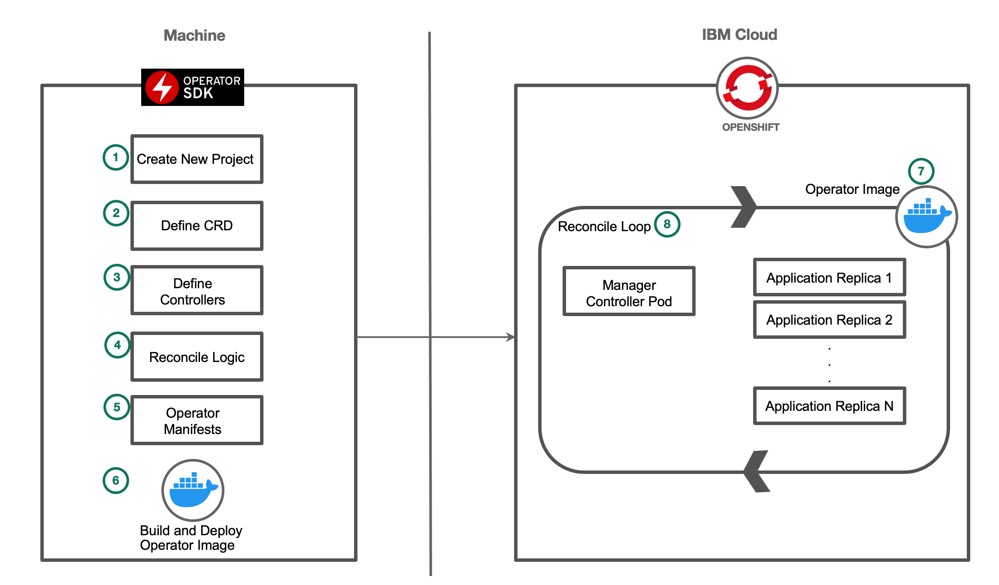
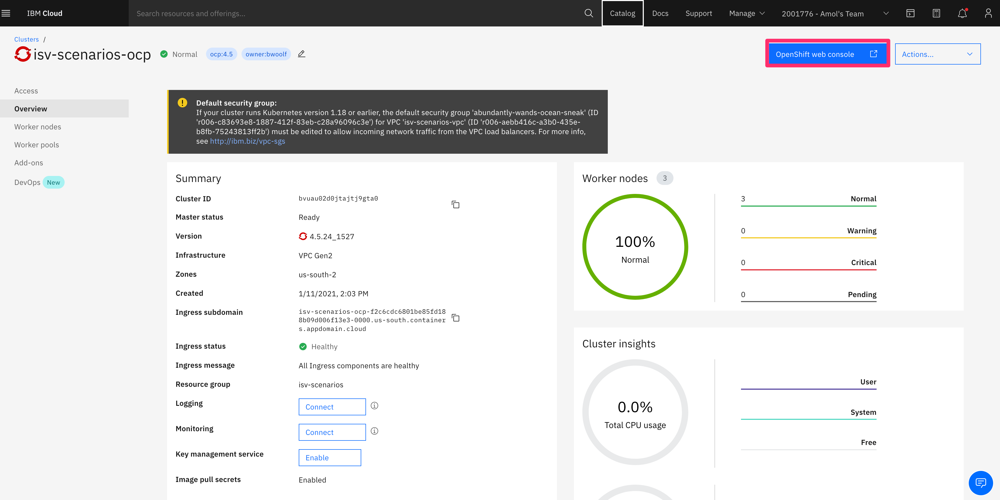
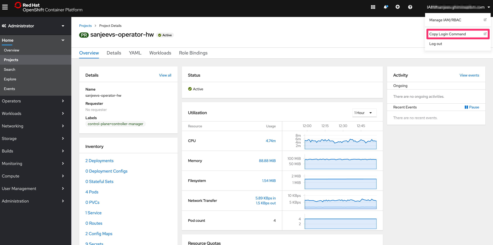
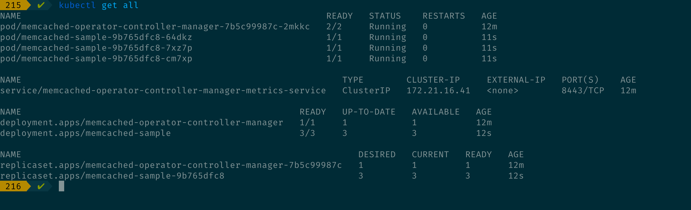
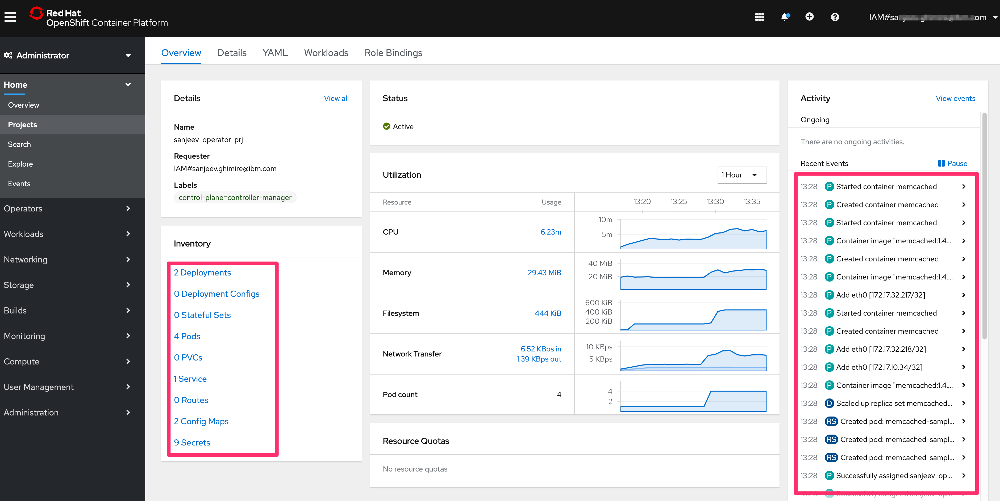
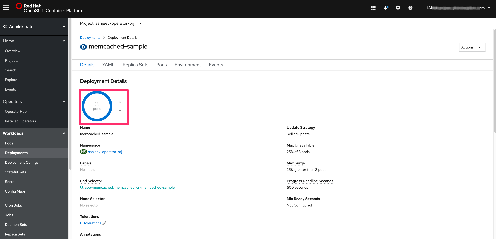

# Develop and deploy a basic Memcached Operator on Red Hat OpenShift

<!--EM: metadata information
Excerpt: Learn how to build and deploy your first Golang-based operator on Red Hat OpenShift."
Abstract: "This tutorial shows you how to build and deploy a Golang-based operator to manage Kubernetes resources."
-->

For developers who understand what Kubernetes operators are and how they work, the next step is to build and deploy one yourself. Follow the steps in this tutorial to develop and deploy a Memcached Operator to Red Hat OpenShift. After completing this tutorial, you will learn the basic concepts and steps needed to develop a Golang-based operator to manage Kubernetes resources.

**Note:** This tutorial can apply to other Kubernetes clusters as well. The commands may differ slightly however.

## Prerequisites

This tutorial assumes you have some knowledge of Kubernetes Operators concepts but little or no experience developing operators. If you need a refresher, read the [Intro to Operators](https://github.ibm.com/TT-ISV-org/operator/blob/main/INTRO_TO_OPERATORS.md) article.

* Set up your environment as shown in the [Set up your environment](https://github.ibm.com/TT-ISV-org/operator/blob/main/installation.md) tutorial.

<!--EM: I think I'll make this a sidebar in the tutorial

If you already know all of the basic concepts of operators and have developed and deployed an operator before you can move on to the [Deep dive into Memcached ](https://github.ibm.com/TT-ISV-org/operator/blob/main/INTERMEDIATE_TUTORIAL.md), which will explain the low-level functions within the Operator reconcile function in more detail. It will also explain the KubeBuilder markers, creating the CRDs from the API, and other important operator-specific details.   -->

**IMPORTANT**
This tutorial is inspired from the [Operator SDK tutorial](https://sdk.operatorframework.io/docs/building-operators/golang/tutorial/). **Thanks to the Operator SDK team** for
a great tutorial.

## Flow



1. Create a new operator project using the Operator SDK Command Line Interface(CLI).
2. Define new resource APIs by adding custom resource definitions(CRD).
3. Define Controllers to watch and reconcile resources.
4. Write the reconciling logic for your controller using the SDK and controller-runtime APIs
5. Use the SDK CLI to build and generate the operator deployment manifests.
6. Use the SDK CLI to build the operator image, push to image registry and then deploy to OpenShift.
7. Operator docker image is deployed to OpenShift cluster creating manager and application replicas.
8. Reconcile loop watches and heals the resources as needed.

## Environment setup

**IMPORTANT**
If you haven't set up your environment for building Kubernetes operators, see these [installation instructions](installation.md).

## Steps
1. [Create a new project using Operator SDK](#1-create-a-new-project-using-operator-sdk)
1. [Create an API and custom controller](#2-create-an-api-and-custom-controller)
1. [Update the API](#3-update-the-api)
1. [Implement controller logic](#4-implement-controller-logic)
1. [Compile, build, and push](#5-compile-build-and-push)
1. [Deploy the operator](#6-deploy-the-operator)
1. [Create the custom resource](#7-create-the-custom-resource)
1. [Test and verify](#8-test-and-verify)

## 1. Create a new project using Operator SDK

1. Check your Go version. This tutorial is tested with the following Go version:

    ```bash
    $ go version
    $ go version go1.15.6 darwin/amd64
    ```
1. Next, create a directory for where you will hold your project files.

    ```bash
    $ mkdir $HOME/projects/memcached-operator
    $ cd $HOME/projects/memcached-operator
    ```
<!--
Since we are not in our $GOPATH, we can activate module support by running the
`export GO111MODULE=on` command before using the operator-sdk. -->

    > Note: before your run the `operator-sdk init` command your `memcached-operator` directory must be completely empty, otherwise KubeBuilder will complain with an error. This means, you can't have a `.git` folder, etc.

1. Run the `operator-sdk init` command to create a new memcached-operator project:

    ```bash
    $ operator-sdk init --domain=example.com --repo=github.com/example/memcached-operator
    ```

    * The `--domain` flag is used to uniquely identify the operator resources that this project creates.
    * The `example.com` domain is used as part of the Kubernetes [API group](https://kubernetes.io/docs/reference/using-api/#api-groups). When we use the command `oc api-resources` later, the `example.com` domain will be listed there by our `memcached` in the `APIGROUP` category.

### Set up your Go modules

You must set up your [Go Modules](https://blog.golang.org/using-go-modules) properly to develop and run your operator. The `--repo` flag sets the name to use for your Go module, which is specified at the top of your `go.mod` file:

    ```go
    module github.com/example/memcached-operator
    ```

Setting up your Go Module enables you to work outside of your [GOPATH](https://golang.org/doc/gopath_code#GOPATH), as long as the working directory of the project is the same as the name of the module in the top of the `go.mod` file.

1. Make sure that your directory is called `memcached-operator` and that your `go.mod` file shows the following Go module:

    ```go
    module github.com/example/memcached-operator
    ```

1. For Go modules to work properly, activate Go module support by running the following command:

    ```bash
    $ export GO111MODULE=on
    ```

1. Verify that Go module support is turned on by issuing the following command and ensuring you get the same output:

    ```bash
    $ echo $GO111MODULE
    on
    ```

You should now have the basic scaffold for your operator, such as the `bin`, `config` and `hack` directories, as well as the `main.go` file which initializes the manager.

## 2. Create an API and custom controller

This section shows you how to use the `operator-sdk create api` command to create an API, which will be in your `api` directory, and a blank custom controller file, which will be in your `controllers` directory.

Use the `--group`, `--version`, and `--kind` flags to pass in the resource group and version. The <b>--group, --version, and --kind</b> flags together form the fully qualified name of a Kubernetes resource type. This name must be unique across a cluster.

```bash
$ operator-sdk create api --group=cache --version=v1alpha1 --kind=Memcached --controller --resource
Writing scaffold for you to edit...
api/v1alpha1/memcached_types.go
controllers/memcached_controller.go
```

* The `--group` flag defines an `API Group` in Kubernetes. It is a collection of related functionality.
* Each group has one or more `versions`, which allows you to change how an API works over time. This is what the `--version` flag represents.
* Each API group-version contains one or more API types, called `Kinds`. This is the name of the API type that we are creating as part of this operator.
  * There are more nuances when it comes to versioning which we will not cover. Read more about groups, versions, kinds, and resources from this [KubeBuilder reference](https://book.kubebuilder.io/cronjob-tutorial/gvks.html).
* The `--controller` flag signifies that the SDK should scaffold a controller file.
* The `--resource` flag signifies that the SDK should scaffold the schema for a resource.


Once you deploy this operator, you can use the `kubectl api-resources` to see the name `cache.example.com` as the api-group, and `Memcached` as the `Kind`. You can try this command
later after you deploy the operator.


### (Optional) Troubleshooting the create api command

If you get an error running the `create api` command, you most likely need to install the modules manually.

Here is an example error:

```bash
Error: go exit status 1: go: github.com/example/memcached-operator/controllers: package github.com/go-logr/logr imported from implicitly required module; to add missing requirements, run:
        go get github.com/go-logr/logr@v0.3.0
```

You will have to install the modules manually by running the following commands:

```bash
$ go get github.com/go-logr/logr@v0.3.0
$ go get github.com/onsi/ginkgo@v1.14.1
$ go get github.com/onsi/gomega@v1.10.2
```

## 3. Update the API

Defining an API is one of the two main parts of the operator pattern. Defining your API creates your custom resource definition(CRD) and is done in the `api/v1alpha1/memcached_types.go` file.

First, you need to understand the struct which defines your schema. Note that it
implements the [Object interface](https://pkg.go.dev/sigs.k8s.io/controller-runtime/pkg/client#Object), which means it is a Kubernetes object. Also,
it has the `Spec` and `Status` fields.

```go
type Memcached struct {
	metav1.TypeMeta   `json:",inline"`
	metav1.ObjectMeta `json:"metadata,omitempty"`

	Spec   MemcachedSpec   `json:"spec,omitempty"`
	Status MemcachedStatus `json:"status,omitempty"`
}
```

### What is the Spec?

The `MemcachedSpec` struct, referenced as the `Spec`, defines the desired state of the resource. A good way to think about `Spec` is that any inputs (values tweaked by the user) to our controller go in the spec section. The [controller code](https://github.ibm.com/TT-ISV-org/operator/blob/main/artifacts/memcached_controller.go#L104) references the `Spec` section to determine how many replicas to deploy.

### What is the Status?

The `MemcachedStatus` struct, referenced as the `Status`, defines the current, observed state of the resource. The status contains information that users or other controllers can easily obtain. The status is updated in the [controller code](https://github.ibm.com/TT-ISV-org/operator/blob/main/artifacts/memcached_controller.go#L132), which updates the current state of the cluster.

The `MemcachedStatus struct` and the `MemcachedSpec struct` each has its own fields to describe the observed state and the desired state, respectively.

1. Add a `Size int32` field to your `MemcachedSpec` struct, along with their JSON-encoded string representation of the field name, in lowercase. See [Golangs JSON encoding page](https://golang.org/pkg/encoding/json/) for more details.

    In our example, since `Size` is the field name, and the JSON encoding must be lowercase, it would look like `json:"size"`.

    Add the following to your struct:


    ```go
    type MemcachedSpec struct {
	    // INSERT ADDITIONAL SPEC FIELDS - desired state of cluster
	    // Important: Run "make" to regenerate code after modifying this file

	    // Foo is an example field of Memcached. Edit Memcached_types.go to remove/update
	    Size int32 `json:"size"`
    }
    ```

    When you create a custom resource later, you need to fill out the size, which is the number of `Memcached` replicas you want as the `desired state` of your system.

1. Add a `Nodes []string` field to your `MemcachedStatus` struct, as shown below:

    ```go
    // MemcachedStatus defines the observed state of Memcached
    type MemcachedStatus struct {
    	// INSERT ADDITIONAL STATUS FIELD - define observed state of cluster
    	// Important: Run "make" to regenerate code after modifying this file
	    Nodes []string `json:"nodes"`
    }
    ```


    The `MemcachedStatus` struct uses a string array to list the name of the Memcached pods in the current state.

    Lastly, the `Memcached` struct has the fields `Spec` and `Status` to denote the desired state (spec) and the observed state (status). At a high-level, when the system recognizes there is a difference in the spec and the status, the operator uses custom controller logic defined in the `controllers/memcached_controller.go` file to update the system to be in the desired state.

### Output and code explanation

Now that you've modified the file `api/v1alpha1/memcached_types.go`, it should look like the [file in the artifacts directory](https://github.ibm.com/TT-ISV-org/operator/blob/main/artifacts/memcached_types.go):

```go
package v1alpha1

import (
	metav1 "k8s.io/apimachinery/pkg/apis/meta/v1"
)

// EDIT THIS FILE!  THIS IS SCAFFOLDING FOR YOU TO OWN!
// NOTE: json tags are required.  Any new fields you add must have json tags for the fields to be serialized.

// MemcachedSpec defines the desired state of Memcached
type MemcachedSpec struct {
	// INSERT ADDITIONAL SPEC FIELDS - desired state of cluster
	// Important: Run "make" to regenerate code after modifying this file

	// Foo is an example field of Memcached. Edit Memcached_types.go to remove/update
	Size int32 `json:"size"`
}

// MemcachedStatus defines the observed state of Memcached
type MemcachedStatus struct {
	// INSERT ADDITIONAL STATUS FIELD - define observed state of cluster
	// Important: Run "make" to regenerate code after modifying this file
	Nodes []string `json:"nodes"`
}

// +kubebuilder:object:root=true
// +kubebuilder:subresource:status

// Memcached is the Schema for the memcacheds API
type Memcached struct {
	metav1.TypeMeta   `json:",inline"`
	metav1.ObjectMeta `json:"metadata,omitempty"`

	Spec   MemcachedSpec   `json:"spec,omitempty"`
	Status MemcachedStatus `json:"status,omitempty"`
}

// +kubebuilder:object:root=true

// MemcachedList contains a list of Memcached
type MemcachedList struct {
	metav1.TypeMeta `json:",inline"`
	metav1.ListMeta `json:"metadata,omitempty"`
	Items           []Memcached `json:"items"`
}

func init() {
	SchemeBuilder.Register(&Memcached{}, &MemcachedList{})
}
```

Above `type Memcached struct`, there are two lines of code starting with `+kubebuilder`. Note that these are actually commented out. These are important, since they
tell the controller-tools extra information. For example, this one

```golang
// +kubebuilder:object:root=true
```

tells the `object` generator that this type represents a Kind. The generator will then implement the `runtime.Object` interface for us, which all Kinds must implement.

This one:

```golang
// +kubebuilder:subresource:status
```

Adds the status `subresource` in the custom resource definition. If you run `make manifests`, it generates YAML under `config/crds/<kind_types.yaml`. It also adds a `subresources`
section like so:

```yaml
subresources:
    status: {}
```

The next section shows you how to get and update the status `subresource` in the controller code.

The key thing to know is that each of these markers, starting with `// +kubebuilder` will generate utility code (such as role-based access control) and Kubernetes YAML. When you run `make generate` and `make manifests` your KubeBuilder Markers is read in order to create RBAC roles, CRDs, and code. Read more about [KubeBuilder markers](https://book.kubebuilder.io/reference/markers.html?highlight=markers#marker-syntax).


## 4. Implement controller logic

> <b>Note</b>: If you want to learn more in depth about the controller logic that is written here,
please view our accompanying article: [Deep dive into Memcached Operator Code](https://github.ibm.com/TT-ISV-org/operator/blob/main/INTERMEDIATE_TUTORIAL.md) article.

Now that the API is updated, the next step is to implement our controller logic in `controllers/memcached_controller.go`.

Copy the code from the
[artifacts/memcached_controller.go](https://github.ibm.com/TT-ISV-org/operator/blob/main/artifacts/memcached_controller.go) file, and replace your current controller code.

Once this is complete, your controller should look like the following:

```go
/*
Copyright 2021.
Licensed under the Apache License, Version 2.0 (the "License");
you may not use this file except in compliance with the License.
You may obtain a copy of the License at
    http://www.apache.org/licenses/LICENSE-2.0
Unless required by applicable law or agreed to in writing, software
distributed under the License is distributed on an "AS IS" BASIS,
WITHOUT WARRANTIES OR CONDITIONS OF ANY KIND, either express or implied.
See the License for the specific language governing permissions and
limitations under the License.
*/

package controllers

import (
	"reflect"

	appsv1 "k8s.io/api/apps/v1"
	corev1 "k8s.io/api/core/v1"
	"k8s.io/apimachinery/pkg/api/errors"
	metav1 "k8s.io/apimachinery/pkg/apis/meta/v1"

	"context"

	"github.com/go-logr/logr"
	"k8s.io/apimachinery/pkg/runtime"
	ctrl "sigs.k8s.io/controller-runtime"
	"sigs.k8s.io/controller-runtime/pkg/client"

	cachev1alpha1 "github.com/example/memcached-operator/api/v1alpha1"
)

// MemcachedReconciler reconciles a Memcached object
type MemcachedReconciler struct {
	client.Client
	Log    logr.Logger
	Scheme *runtime.Scheme
}

// generate rbac to get, list, watch, create, update and patch the memcached status the nencached resource
// +kubebuilder:rbac:groups=cache.example.com,resources=memcacheds,verbs=get;list;watch;create;update;patch;delete

// generate rbac to get, update and patch the memcached status the memcached/finalizers
// +kubebuilder:rbac:groups=cache.example.com,resources=memcacheds/status,verbs=get;update;patch

// generate rbac to update the memcached/finalizers
// +kubebuilder:rbac:groups=cache.example.com,resources=memcacheds/finalizers,verbs=update

// generate rbac to get, list, watch, create, update, patch, and delete deployments
// +kubebuilder:rbac:groups=apps,resources=deployments,verbs=get;list;watch;create;update;patch;delete

// generate rbac to get,list, and watch pods
// +kubebuilder:rbac:groups=core,resources=pods,verbs=get;list;watch

// Reconcile is part of the main kubernetes reconciliation loop which aims to
// move the current state of the cluster closer to the desired state.
// TODO(user): Modify the Reconcile function to compare the state specified by
// the Memcached object against the actual cluster state, and then
// perform operations to make the cluster state reflect the state specified by
// the user.
//
// For more details, check Reconcile and its Result here:
// - https://pkg.go.dev/sigs.k8s.io/controller-runtime@v0.7.0/pkg/reconcile
func (r *MemcachedReconciler) Reconcile(ctx context.Context, req ctrl.Request) (ctrl.Result, error) {
	log := r.Log.WithValues("memcached", req.NamespacedName)

	// Fetch the Memcached instance
	memcached := &cachev1alpha1.Memcached{}
	err := r.Get(ctx, req.NamespacedName, memcached)
	if err != nil {
		if errors.IsNotFound(err) {
			// Request object not found, could have been deleted after reconcile request.
			// Owned objects are automatically garbage collected. For additional cleanup logic use finalizers.
			// Return and don't requeue
			log.Info("Memcached resource not found. Ignoring since object must be deleted")
			return ctrl.Result{}, nil
		}
		// Error reading the object - requeue the request.
		log.Error(err, "Failed to get Memcached")
		return ctrl.Result{}, err
	}

	// Check if the deployment already exists, if not create a new one
	found := &appsv1.Deployment{}
	err = r.Get(ctx, req.NamespacedName, found)
	if err != nil && errors.IsNotFound(err) {
		// Define a new deployment
		dep := r.deploymentForMemcached(memcached)
		log.Info("Creating a new Deployment", "Deployment.Namespace", dep.Namespace, "Deployment.Name", dep.Name)
		err = r.Create(ctx, dep)
		if err != nil {
			log.Error(err, "Failed to create new Deployment", "Deployment.Namespace", dep.Namespace, "Deployment.Name", dep.Name)
			return ctrl.Result{}, err
		}
		// Deployment created successfully - return and requeue
		return ctrl.Result{Requeue: true}, nil
	} else if err != nil {
		log.Error(err, "Failed to get Deployment")
		return ctrl.Result{}, err
	}

	// Ensure the deployment size is the same as the spec
	size := memcached.Spec.Size
	if *found.Spec.Replicas != size {
		found.Spec.Replicas = &size
		err = r.Update(ctx, found)
		if err != nil {
			log.Error(err, "Failed to update Deployment", "Deployment.Namespace", found.Namespace, "Deployment.Name", found.Name)
			return ctrl.Result{}, err
		}
		// Spec updated - return and requeue
		return ctrl.Result{Requeue: true}, nil
	}

	// Update the Memcached status with the pod names
	// List the pods for this memcached's deployment
	podList := &corev1.PodList{}
	listOpts := []client.ListOption{
		client.InNamespace(memcached.Namespace),
		client.MatchingLabels(labelsForMemcached(memcached.Name)),
	}
	if err = r.List(ctx, podList, listOpts...); err != nil {
		log.Error(err, "Failed to list pods", "Memcached.Namespace", memcached.Namespace, "Memcached.Name", memcached.Name)
		return ctrl.Result{}, err
	}
	podNames := getPodNames(podList.Items)

	// Update status.Nodes if needed
	if !reflect.DeepEqual(podNames, memcached.Status.Nodes) {
		memcached.Status.Nodes = podNames
		err := r.Status().Update(ctx, memcached)
		if err != nil {
			log.Error(err, "Failed to update Memcached status")
			return ctrl.Result{}, err
		}
	}

	return ctrl.Result{}, nil
}

// deploymentForMemcached returns a memcached Deployment object
func (r *MemcachedReconciler) deploymentForMemcached(m *cachev1alpha1.Memcached) *appsv1.Deployment {
	ls := labelsForMemcached(m.Name)
	replicas := m.Spec.Size

	dep := &appsv1.Deployment{
		ObjectMeta: metav1.ObjectMeta{
			Name:      m.Name,
			Namespace: m.Namespace,
		},
		Spec: appsv1.DeploymentSpec{
			Replicas: &replicas,
			Selector: &metav1.LabelSelector{
				MatchLabels: ls,
			},
			Template: corev1.PodTemplateSpec{
				ObjectMeta: metav1.ObjectMeta{
					Labels: ls,
				},
				Spec: corev1.PodSpec{
					Containers: []corev1.Container{{
						Image:   "memcached:1.4.36-alpine",
						Name:    "memcached",
						Command: []string{"memcached", "-m=64", "-o", "modern", "-v"},
						Ports: []corev1.ContainerPort{{
							ContainerPort: 11211,
							Name:          "memcached",
						}},
					}},
				},
			},
		},
	}
	// Set Memcached instance as the owner and controller
	ctrl.SetControllerReference(m, dep, r.Scheme)
	return dep
}

// labelsForMemcached returns the labels for selecting the resources
// belonging to the given memcached CR name.
func labelsForMemcached(name string) map[string]string {
	return map[string]string{"app": "memcached", "memcached_cr": name}
}

// getPodNames returns the pod names of the array of pods passed in
func getPodNames(pods []corev1.Pod) []string {
	var podNames []string
	for _, pod := range pods {
		podNames = append(podNames, pod.Name)
	}
	return podNames
}

// SetupWithManager sets up the controller with the Manager.
func (r *MemcachedReconciler) SetupWithManager(mgr ctrl.Manager) error {
	return ctrl.NewControllerManagedBy(mgr).
		For(&cachev1alpha1.Memcached{}).
		Owns(&appsv1.Deployment{}).
		Complete(r)
}
```

## 5. Compile, build, and push

Now you are ready to compile, build the image of our operator, and push the image to an image repository. You can use the image registry of your choice, but this tutorial uses Docker Hub. If you plan on deploying to an OpenShift cluster, log in to your cluster now.

1. From your provisioned cluster which you set up in the `installation.md` file, select the cluster.
1. Open the `OpenShift web console` by clicking the button on the top right corner of the page.

    

1. From the OpenShift web console, copy the login command from the account drop-down menu.

    

1. From your terminal, run the command to log in to your cluster. Once you've logged in, you should see output like the following:

    ```bash
    $ oc login --token=fFQ-HbFVBT4qHKl1n0b*****63U --server=https://c****-e.us-south.containers.cloud.ibm.com:31047
    s-south.containers.cloud.ibm.com:31047

    Logged into "https://c116-e.us-south.containers.cloud.ibm.com:31047" as "IAM#horea.porutiu@ibm.com" using the token provided.

    You have access to 84 projects, the list has been suppressed. You can list all projects with 'oc projects'

    Using project "horea-test-scc".
    ```

    <b>This is extremely important.</b> By running the login command, you should now be able to run `oc project` to see which project you
are currently in. The project you're in is your namespace as well. This is important since our operator only runs in the namespace we deploy it to. OpenShift connects to your cluster via this login command, and if you do not do this step properly, you will not be able to deploy your operator.

1. Create a new project using the following command:

    ```bash
    $ oc new-project <new-project-name>
    ```

1. Once you create a new project, you will be automatically switched to that project, as the output below shows:

    ```bash
    $ oc new-project memcache-demo-project
    Now using project "memcache-demo-project" on server "https://c116-e.us-south.containers.cloud.ibm.com:31047".
    ```

For the rest of the tutorial, use `memcache-demo-project` (or whatever you named your project), as your namespace. The following steps go into more detail about this, but keep in mind that your project is the same as your namespace in terms of OpenShift.

### Create CRD and RBAC

The generated code from the `operator-sdk` creates a `Makefile`. This `Makefile` allows you to use the `make` command to compile your `go` operator code.

1. Now that your controller code and API is implemented, run the following command to implement the required Go type interfaces:

    ```bash
    $ make generate
    ```

    The above command updates your `api/v1alpha1/zz_generated.deepcopy.go` file to implement the [metav1.Object](https://pkg.go.dev/k8s.io/apimachinery/pkg/apis/meta/v1#Object) and [runtime.Object](https://pkg.go.dev/k8s.io/apimachinery/pkg/runtime#Object) interfaces. This enables your custom resource to be treated like a native Kubernetes resource.

1. After the code is generated for your custom resource, you can use the `make manifests` command to generate CRD manifests and RBAC from KubeBuilder Markers:

    ```bash
    $ make manifests
    ```

This command invokes `controller-gen` to generate the CRD manifests at `config/crd/bases/cache.example.com_memcacheds.yaml`. You can see the YAML representation of the object you specified in your `_types.go` file. It also generates RBAC YAML files in the `config/rbac` directory based on
your KubeBuilder markers.


Don't worry about [KubeBuilder Markers](https://book.kubebuilder.io/reference/markers.html) for now, we cover them in the [deep-dive article](https://github.ibm.com/TT-ISV-org/operator/blob/main/INTERMEDIATE_TUTORIAL.md#6-understanding-kubebuilder-markers).

### Compile your operator

To compile the code, run the following command in the terminal from your project root:

```bash
$ make install
```

### Set the operator namespace

Now you need to update your config to tell your operator to run in your own project namespace. Do this by issuing the following Kustomize
commands:

```bash
$ export IMG=docker.io/<username>/memcached-operator:<version>
$ export NAMESPACE=<oc-project-name>

$ cd config/manager
$ kustomize edit set image controller=${IMG}
$ kustomize edit set namespace "${NAMESPACE}"
$ cd ../../

$ cd config/default
$ kustomize edit set namespace "${NAMESPACE}"
$ cd ../../
```

`<username>` is your Docker Hub (or Quay.io) username, and `<version>` is the
version of the operator image you will deploy. Note that each time you
make a change to your operator code, it is good practice to increment the
version. `NAMESPACE` is the `oc` project name where you plan to deploy your operator. For me, this is `memcache-demo-project`.

For example, my export statements would look like the following:

```bash
$ export IMG=docker.io/horeaporutiu/memcached-operator:latest
$ export NAMESPACE=memcache-demo-project
```

### Build and push your image

**Note:** You will need to have an account to a image repository like Docker Hub to be able to push your
operator image. Use `Docker login` to log in.

1. To build the Docker image, run the following command. Note that you can also use the regular `docker build -t` command to build as well.

    ```bash

    $ make docker-build IMG=$IMG
    ```

1. Push the Docker image to your registry using following from your terminal:

```bash
$ make docker-push IMG=$IMG
```

## 6. Deploy the operator to your OpenShift cluster

1. To deploy the operator, run the following command from your terminal:

    ```bash
    $ make deploy IMG=$IMG
    ```

    The output of the deployment should look like the following:

    ```bash
    ...go-workspace/src/memcached-operator/bin/controller-gen "crd:trivialVersions=true,preserveUnknownFields=false" rbac:roleName=manager-role webhook paths="./..." output:crd:artifacts:config=config/crd/bases
    cd config/manager && ...go-workspace/src/memcached-operator/bin/kustomize edit set image controller=sanjeevghimire/memcached-operator:v0.0.5
    .../go-workspace/src/memcached-operator/bin/kustomize build config/default | kubectl apply -f -
    Warning: kubectl apply should be used on resource created by either kubectl create --save-config or kubectl apply
    namespace/sanjeev-operator-prj configured
    customresourcedefinition.apiextensions.k8s.io/memcacheds.cache.example.com configured
    role.rbac.authorization.k8s.io/memcached-operator-leader-election-role created
    clusterrole.rbac.authorization.k8s.io/memcached-operator-manager-role configured
    clusterrole.rbac.authorization.k8s.io/memcached-operator-metrics-reader unchanged
    clusterrole.rbac.authorization.k8s.io/memcached-operator-proxy-role unchanged
    rolebinding.rbac.authorization.k8s.io/memcached-operator-leader-election-rolebinding created
    clusterrolebinding.rbac.authorization.k8s.io/memcached-operator-manager-rolebinding configured
    clusterrolebinding.rbac.authorization.k8s.io/memcached-operator-proxy-rolebinding configured
    configmap/memcached-operator-manager-config created
    service/memcached-operator-controller-manager-metrics-service created
    deployment.apps/memcached-operator-controller-manager created
    ```

1. To make sure everything is working correctly, use the `oc get pods` command.

    ```bash
    $ oc get pods

    NAME                                                     READY   STATUS    RESTARTS   AGE
    memcached-operator-controller-manager-54c5864f7b-znwws   2/2     Running   0          14s
    ```

This means your operator is up and running. Great job!

## 7. Create the custom resource

Next, let's create the custom resource.

1. Update your custom resource, by modifying the `config/samples/cache_v1alpha1_memcached.yaml` file to look like the following:

    ```yaml
    apiVersion: cache.example.com/v1alpha1
    kind: Memcached
    metadata:
      name: memcached-sample
    spec:
      # Add fields here
      size: 3
    ```

    Note the only change was to set the size of the Memcached replicas to be 3.

1. Finally, create the custom resources using the following command:

    ```bash
    $ kubectl apply -f config/samples/cache_v1alpha1_memcached.yaml
    ```

#### Verify that resources are running

1. From the terminal, run `kubectl get all` or `oc get all` to make sure that controllers, managers, and pods have been successfully created and are in `Running` state with the right number of pods as defined in the spec.

    ```bash
    $ kubectl get all
    ```

    Output:
    

1. From your cluster you can see the logs by going to your project in the OpenShift web console.

    

1. You can also now run `oc api-resources` to view the memcache resource  you created:

    ```bash
    $ oc api-resources
    NAME                APIGROUP                  NAMESPACED   KIND
    memcacheds         cache.example.com          true         Memcached
    ```

1. If you want to make some code changes in the controller and build and deploy a new version of your operator, you can simply use the `build-and-deploy.sh` script. Just make sure to set your namespace and img in that file.

    Run the script by issuing the following command:

    ```bash
    $ ./build-and-deploy.sh
    ```

## 8. Test and verify

1. Update `config/samples/<group>_<version>_memcached.yaml` to change the `spec.size` field in the Memcached CR. This increases the application pods from 3 to 5. It can also be patched directly in the cluster as follows: <!--EM What is the "It" that this sentence references?-->

    ```bash
    $ oc patch memcached memcached-sample -p '{"spec":{"size": 5}}' --type=merge
    ```

1. You can also update the spec.size from your OpenShift web console by going to `Deployments` and selecting `memcached-sample`. Increase or decrease the spec.size using the up or down arrow:

    

1. Next, verify that your pods have scaled up. Run the following command:

    ```bash
    $ kubectl get pods
    ```

You should now see that there are 5 total `memcached-sample` pods.

**Congratulations!** You've successfully deployed an Memcached operator using the `operator-sdk`! To learn more, read
the [Deep dive into Memcached Operator Code](https://github.ibm.com/TT-ISV-org/operator/blob/main/INTERMEDIATE_TUTORIAL.md) tutorial,
which explains the controller logic from step 4 in more depth.


## Cleanup

The `Makefile` part of generated project has a target called `undeploy` which deletes all the resources associated with your project. It can be run as follows:

```bash
$ make undeploy
```

# License

This code pattern is licensed under the Apache Software License, Version 2.  Separate third party code objects invoked within this code pattern are licensed by their respective providers pursuant to their own separate licenses. Contributions are subject to the [Developer Certificate of Origin, Version 1.1 (DCO)](https://developercertificate.org/) and the [Apache Software License, Version 2](https://www.apache.org/licenses/LICENSE-2.0.txt).

[Apache Software License (ASL) FAQ](https://www.apache.org/foundation/license-faq.html#WhatDoesItMEAN)
