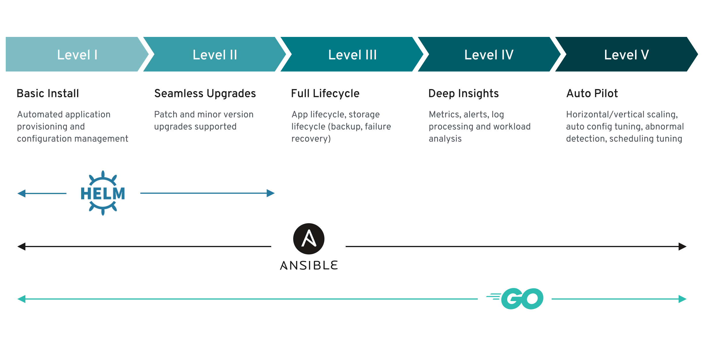
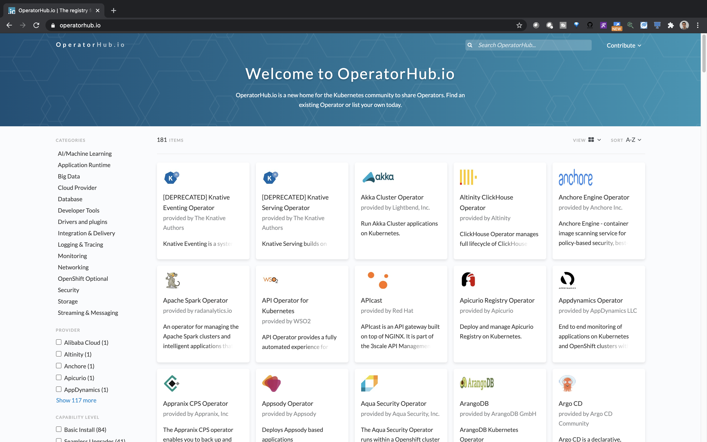

# Intro to Operators

This article will be the first in a series of articles and tutorials on learning how to build and deploy 
a Kubernetes Operator. 

This article will assume you have no knowledge on Kubernetes Operators, and will 
give you all of the basic knowledge needed to develop a
Golang based operator. If you are already familiar with operators, you can either skim this article or 
simply skip ahead to the [develop and deploy a Memcached Operator on OpenShift](https://github.ibm.com/TT-ISV-org/operator/blob/main/BEGINNER_TUTORIAL.md) which shows how to develop and deploy your first operator to 
an OpenShift cluster, or go back to one of the other articles in the [learning path](https://github.ibm.com/TT-ISV-org/operator#kubernetes-operators-learning-path).

## Expectations (What you have)
* You have little to no experience developing operators
* You have little to no knowledge on Kubernetes Operators concepts
* You have a basic understanding of Kubernetes concepts

## Expectations (What you want)
* You want to learn the basic concepts and steps needed to develop a Golang based operator to manage Kubernetes resources

## Estimated time
* This article should take roughly 15-30 minutes to complete, depending on how long you spend reading through 
documentation.

## Outline
1. [What are operators](#1-What-are-operators)
1. [What do operators do](#2-what-do-operators-do)
1. [Operator SDK](#3-Operator-SDK)
1. [Operator Capability Levels](#4-operator-capability-levels)
1. [Operator Hub](#5-Operator-Hub)

## 1. What are operators
[Operators](https://kubernetes.io/docs/concepts/extend-kubernetes/operator/) are extensions to Kubernetes that make use of custom resources 
to manage Kubernetes applications and their components. Operators are used to automate software configuration and maintenance activities 
that are typically done by human operators. That's why they are called operators. Kubernetes is great at managing 
stateless applications, but when you need more complex configuration details for a stateful application, such as a 
database, that is when operators are very useful. Other more complex lifecycle management tasks such as patches and minor
upgrades can be automated using an operator. 

Operators are application-specific controllers which extend the functionality of the Kubernetes API to manage instances of complex applications, on behalf of a Kubernetes admin. The [custom resource](https://kubernetes.io/docs/concepts/extend-kubernetes/api-extension/custom-resources/)(CR) is the mechanism through which the Kubernetes API is extended. 
A Custom Resource Definition (CRD) lists out all of the configuration available to users of the operator. 

In Kubernetes, controllers of the
[control plane](https://kubernetes.io/docs/reference/glossary/?all=true#term-control-plane) implement control loops that repeatedly compare the desired state of the cluster to its actual state. If the states don't match,
then the controller takes action to fix the problem. Similarly, a Kubernetes operator watches a specific CR type and takes application-specific actions to make the current state match the desired state in that resource.

Operators have the following features:

* The user provides configuration and settings within a CR, and then the operator translates the configuration into low-level actions,
based on the logic defined in the operator's custom controller logic.
* Operator introduce new object types through its custom resource definition. These objects can be handled by the Kubernetes API just like
native Kubernetes objects, including interaction via `kubectl` and inclusion in role-based access control policies.

Read more about operators from this [Red Hat blog](https://www.redhat.com/en/topics/containers/what-is-a-kubernetes-operator).

## 2. What do operators do

Operators extend the control plane by adding another controller to the control plane. Operators enable a developer to write an API and custom controller logic to help manage 
a particular service, such as a database. Instead of the admin using `kubectl` commands 
in order to change the desired state, an operator does this for you, automatically, using 
its custom controller. This is illustrated in the `How an operator deploys a workload` section
from the image above.
 
## Why does Kubernetes need operators?

Kubernetes needs operators in order to automate tasks which are normally done manually by a 
SRE. Instead of having to set up multiple deployments, configmaps, secrets, and services, as 
an end user, you can just deploy your operator instead. Your operator will take care of everything
needed to make sure your service is up and running. The approach of using an operator is 
inherently easier, and scales better, than creating all of the deployments, configmaps, secrets, and services manually. 

## 3. Operator SDK

Operator SDK is an open source toolkit that provides tools to build, test and package operators. The SDK cli allows you to scaffold a project and also provides commands to generate code. Also operator SDK makes use of `make`, a build automation tool, to build, test, package and deploy your operator through series of `make` commands that is provided in generated `Makefile`. The `Makefile` comes with pre-built commands like below which we will be using in our project.

* `make manifests` generates manifests `yaml` definitions based on `kubebuilder` markers.
* `make install` compiles your code and create executables.
* `make generate` updates the generated code based on your operator API schema.
* `make docker-build` builds the operator docker image.
* `make docker-push` pushes the operator docker image.
* `make deploy` deploys all the resources to the cluster.
* `make undeploy` deletes all the deployed resources from the cluster.

Operator SDK also allows you to install OLM (operator lifecycle manager) using `operator-sdk olm install` command. OLM is a set of cluster resources that manage the lifecycle of an Operator. Once installed, you can get the status of the OLM using `operator-sdk olm status`, to make sure all the resources in the cluster are in `installed` status.

## 4. Operator Capability Levels

Operators come in different maturity levels in regards to their lifecycle management capabilities. This model aims to provide 
guidance in terms of what features users can expect from a particular operator. As you can see from the picture above, only
Ansible and Go can be used to achieve all five capability levels. Helm can only be used to achieve seamless upgrades and basic install. <b>Capability levels build on top of one another. That means if you have level 3 capabilities, then you should have all capabilities required from Level 1 and Level 2.</b>

Let's take a look at level one in more detail:

### Operator Capability Level 1 - Basic Install 

In level 1, your operator can provision an application through a custom resource. All of the configuration
details are specified in the CR. You should also be able to install your operator in multiple ways (`kubectl`, Operator Hub, 
or through the Operator Lifecycle Manager). Avoid the practice of making the user create / manage configuration files outside
of Kubernetes.

### Level 1 Example - installing the workload

The operator deploys a database by creating a `Deployment`, `ServiceAccount`, `RoleBinding`, `ConfigMap`, `PersistentVolumeClaim`,
and `Secret` objects. It then initializes an empty database schema, and alerts the user when the database is ready to accept requests by updating the `status` section of the custom resource.

### Level 1 Example - managing the workload

Now, let's say that you want to increase the capacity of your underlying database. How would you do this through the operator?
This should be done by resizing the `PersistentVolumeClaim` resources within the `Spec` section of the Custom Resource. Once 
these changes are applied, the operator will take care of scaling the underlying `PersistentVolumeClaim` resource to match 
what was declared in the `Spec` section of the Custom Resource. 

To read more about the other capability levels, read this article from the [Operator SDK documentation](https://sdk.operatorframework.io/docs/advanced-topics/operator-capabilities/operator-capabilities/).

## 5. Operator Hub

[OperatorHub.io](https://operatorhub.io/) is where you can find and share Operators. As you can see in the picture above, there
are more than 180 different operators to choose from on OperatorHub.io. OperatorHub.io is very important since this is where 
you can use other operators to automate the configuration of your Kubernetes applications, and submit your own operator to be published online. All of the details of how to package, test, preview, and submit your operator can be found in [this article](https://operatorhub.io/contribute). 

## Conclusion
In this article, we learned about how operators can extend the base Kubernetes functionality 
by the use of custom controllers and custom resources. We've also learned that the Operator SDK offers code scaffolding 
tools to enable you to write your operator faster, and offers guidelines for the capability levels of an operator. Lastly,
we learned that we can view operators and submit our own on OperatorHub.io.

In the [next article](https://github.ibm.com/TT-ISV-org/operator/blob/main/articles/demystified.md), we will dive deeper 
into the Kubernetes architecture that enables operators to work. 

If you would rather go straight to developing an operator, you can go to the intermediate level tutorial [develop and deploy and operator to OpenShift](https://github.ibm.com/TT-ISV-org/operator/blob/main/BEGINNER_TUTORIAL.md) tutorial instead.

<!-- ### Sources

The information in this article can be found in a few different sources:

* Kubernetes Operators by Jason Doies and Joshua Wood (O'Reilly)

* http://kublr.com/blog/understanding-kubernetes-operators

* https://kubernetes.io/docs/concepts/extend-kubernetes/operator/

* https://www.redhat.com/en/topics/containers/what-is-a-kubernetes-operator -->

<!-- 

**To understand how Operators work at a high level, first we need to understand some of the basic features of how Kubernetes works**, features which Operators take advantage of.

### Workloads on Kubernetes

A "workload" is an application running on Kubernetes. Usually, this is done in as a `Deployment`. A [`Deployment`](https://kubernetes.io/docs/concepts/workloads/controllers/deployment/) runs a set of pod replicas which just ensures that a certain amount of pods are running at a given time. 

Once your application is running, you can make it available as a `Service`. A [`Service`](https://kubernetes.io/docs/concepts/services-networking/service/) is a way to expose an application running on a set of Pods as an endpoint, so that other client applications can invoke your 
service. 

## How Kubernetes works 
Each Kubernetes cluster consists of the components that make up the control plane (more on that later) and at least one worker machine 
called a `node`.  A node may be a physical or virtual machine. The worker nodes host the 
application workload in the form of Pods. More worker nodes on more computers provide more 
capacity for running workloads.

The [control plane](https://kubernetes.io/docs/reference/glossary/?all=true#term-control-plane) manages the worker nodes and Pods in your cluster.

### Control Plane Components -->

<!--  -->
<!--  -->
<!-- 
The two control plane components that are very important for operator development are
the `kube-apiserver` (also known as API server or Kubernetes API) and the `kube-controller-manager`.
Whenever an admin works with a tool such as the 
`kubectl` CLI, the admin is using the `kube-apiserver` to tell the control plane to manage the cluster in a 
certain way. When we deploy a workload, the `kube-controller-manager` will use its controllers to update resources so that the actual state is the same as the desired state.

To learn more about control plane components, read from the [official Kubernetes documentation](https://kubernetes.io/docs/concepts/overview/components/#control-plane-components). 

## Controllers

A control loop is a loop which regulates the state of the system. **The control loop is the heart of Kubernetes and its declaritive system.** In Kubernetes, controllers are control 
loops that watch the current state of the cluster. Each controller tries to move the current
state closer to the desired state.

### Desired State and Current State
A cluster has two states: the desired (or expected) state, and the current state.

If those two states differ, the [controller](https://kubernetes.io/docs/concepts/architecture/controller/) will communicate with the API server
to create, delete, or update resources until the `current state` is the same as the `desired state`. Cluster administrators 
are able to change the desired state of the cluster by issuing commands such as `kubectl create` 
or `kubectl apply -f`.

**You will see `spec` used a lot throughout Kubernetes documentation and that refers to `desired state`. In turn, `status` refers to current state.** 

### Controller pattern
Each controller will watch one specific type of Kubernetes resource. Each resource will have a 
field called `spec` which is the `desired state` of that resource. When it comes to operators we will be using the controller pattern to create a custom controller and a custom resource, and have our controller watch our custom resource.

The controller for that resource is responsible for bringing the `current state`
to be closer (and eventually be equal) to the `desired state` using the API server. Read 
more about this topic [here](https://kubernetes.io/docs/concepts/architecture/controller/#controller-pattern).

### Kubernetes Design

Kubernetes uses lots of different controllers which each manage one aspect of the cluster. To align the current state with the desired state, the `kube-controller-manager` iterates through a set of controllers (Deployment controller, Job controller, etc.) in an infinite loop that detects how current state is different from desired state and adjusts current state to eliminate (attempt to eliminate) those differences. 

Controllers can act on core resources such as deployments or services, which are typically part of the Kubernetes controller manager in the control plane, or can watch and manipulate user-defined custom resources. The user-defined custom resources are what an operator helps manage.  -->

<!-- 
## Custom Resources
A Custom Resource is how we can extend the Kubernetes API. A [Custom Resource Definition](https://kubernetes.io/docs/concepts/extend-kubernetes/api-extension/custom-resources/#customresourcedefinitions) is a 
type of resource in Kubernetes which defines a Custom Resource and all of the fields that 
are associated with a particular resource. 

When we develop an operator, we will use the SDK to create our API file, i.e. our `*_types.go` file.
The operator SDK has a utility function which will help us automatically generate CRD's from our 
API file. More on this in the next tutorial.

High-level configuration is inputted by the user in the CR, and then the operator takes 
whatever action is necessary as indicated by the custom controller logic (the reconcile function we will write in the next tutorial) to ensure the actual state matches the desired state.

## Custom Controllers

Like other controllers, Operator controllers watch for a particular type of resource, which is defined 
in the Custom Resource Definition. Once a user inputs values into the custom resource, the 
desired state of the custom resource has changed, and the Operator API is invoked. Meanwhile, the Operator's custom controller is running its control loop so it sees these changes and it works to reconcile the changes.
From the picture above, you can see that the operator controller calls the Kube API to manage your particular service. The scenarios that it calls the Kube API are programmed into the custom controller. The Kube API will in turn 
change the cluster's desired state to be what is specified by the Operator Controller. From
this point, all that happens in the cluster is the same that happens when an admin uses 
the `kubectl` command - the Kubernetes core controllers will act on the differences between
the current state and the desired state, and reconcile the differences.  -->
