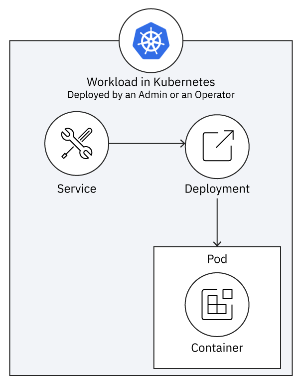
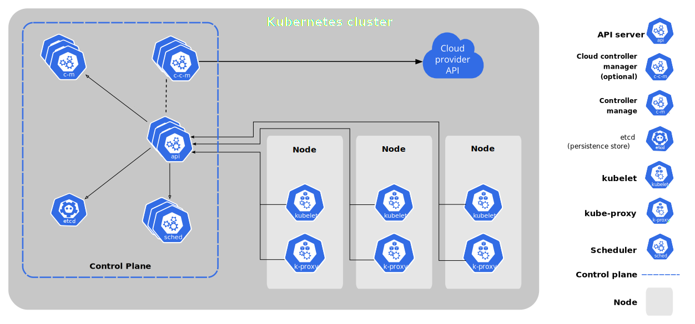

# Intro to Operators

This article will be the first in a series of articles and tutorials on learning how to build and deploy 
a Kubernetes Operator. 

This article will assume you have no knowledge on Kubernetes Operators, and will 
give you all of the basic knowledge needed to understand the different components and concepts of developing a
a Golang based operator. If you are already familiar with operators, you can either skim this article or 
simply skip ahead to the `SIMPLE_OPERATOR.md` file which shows how to develop and deploy your first operator to 
an OpenShift cluster.

## Expectations (What you have)
* You have little to no experience developing operators
* You have little to no knowledge on Kubernetes Operators concepts

## Expectations (What you want)
* You want to learn the basic concepts and steps needed to develop a Golang based operator to manage Kubernetes resources

## Estimated time
* This article should take roughly 15-30 minutes to complete, depending on how long you spend reading through 
documentation.

**To understand how Operators work at a high level, first we need to understand some of the basic features of how Kubernetes works**, features which Operators take advantage of.

### Workloads on Kubernetes

A "workload" is an application running on Kubernetes. Usually, this is done in as a `Deployment`. A [`Deployment`](https://kubernetes.io/docs/concepts/workloads/controllers/deployment/) runs a set of pod replicas which just ensures that a certain amount of pods are running at a given time. 

Once your application is running, you can make it available as a `Service`. A [`Service`](https://kubernetes.io/docs/concepts/services-networking/service/) is a way to expose an application running on a set of Pods as an endpoint, so that other client applications can invoke your 
service. 

<!-- ### Using Pods
If you want to get started using Pods, you must decide on which [workload resource](https://kubernetes.io/docs/concepts/workloads/controllers/) you should use to create your Pod. A common workload is a deployment or a job, or a statefulset if you need to track state.  

To read more in depth about Pods, go to the [official Kubernetes documentation](https://kubernetes.io/docs/concepts/workloads/pods/). -->
<!-- 
## What are Deployments
A deployment "provides declarative updates for Pods and ReplicaSets". You describe a **desired state** (keep
this in mind, since "desired state" will become very important for us), and the deployment controller changes 
the actual state to the desired state. One of the most common use case of using a Deployment is to rollout
a ReplicaSet.

To read more in depth about Deployments, go to the [official Kubernetes documentation for Deployments](https://kubernetes.io/docs/concepts/workloads/controllers/deployment/).

## What are ReplicaSets
A ReplicaSet's purpose is to "maintain a stable set of replica Pods running at any given time". It is used to 
guarantee a specified number of identical pods. A ReplicaSet is defined with three main fields:
1. A `selector` field which specifies how to identify Pods it can acquire. This can be done in the form of `labels`.
2. A `number of replicas` field which indicates how many Pods the ReplicaSet should maintain.
3. A `Pod template` field which specifies the data of new Pods it should create to meet the `number of replicas` requirement. This is what the ReplicaSet will use to create new Pods.

The ReplicaSet then creates and deletes pods as needed to reach the desired `number of replicas` i.e. the desired state.

To read more in depth about ReplicaSets, go to the [official Kubernetes documentation for ReplicaSets](https://kubernetes.io/docs/concepts/workloads/controllers/replicaset/). -->

## How Kubernetes works 
Each Kubernetes cluster consists of the components that make up the control plane (more on that later) and at least one worker machine 
called a `node`.  A node may be a physical or virtual machine. The worker nodes host the 
application workload in the form of Pods. More worker nodes on more computers provide more 
capacity for running workloads.

The [control plane](https://kubernetes.io/docs/reference/glossary/?all=true#term-control-plane) manages the worker nodes and Pods in your cluster.

### Control Plane Components

<!--  -->

The two control plane components that are very important for operator development are
the `kube-apiserver` (also known as API server or Kubernetes API) and the `kube-controller-manager`.
Whenever an admin works with a tool such as the 
`kubectl` CLI, the admin is using the `kube-apiserver` to tell the control plane to manage the cluster in a 
certain way. When we create a 
new operator, our new custom controller will be added
to the `kube-controller-manager's` control loop so that
it has the same core functionality as the other core 
Kubernetes controllers.

To learn more about control plane components, read from the [official Kubernetes documentation](https://kubernetes.io/docs/concepts/overview/components/#control-plane-components). 

## Controllers

A control loop is a loop which regulates the state of the system. **The control loop is the heart of Kubernetes and its declaritive system.** In Kubernetes, controllers are control 
loops that watch the current state of the cluster. Each controller tries to move the current
state closer to the desired state.

### Desired State and Current State
A cluster has two states: the desired (or expected) state, and the current state.

If those two states differ, the [controller](https://kubernetes.io/docs/concepts/architecture/controller/) will communicate with the API server
to create, delete, or update resources until the `current state` is the same as the `desired state`. Cluster administrators 
are able to change the desired state of the cluster by issuing commands such as `kubectl create` 
or `kubectl apply -f`.

**You will see `spec` used a lot throughout Kubernetes documentation and that refers to `desired state`. In turn, `status` refers to current state.** 

### Controller pattern
Each controller will watch one specific type of Kubernetes resource. Each resource will have a 
field called `spec` which is the `desired state` of that resource. When it comes to operators we will be using the controller pattern to create a custom controller and a custom resource, and have our controller watch our custom resource.

The controller for that resource is responsible for bringing the `current state`
to be closer (and eventually be equal) to the `desired state` using the API server. Read 
more about this topic [here](https://kubernetes.io/docs/concepts/architecture/controller/#controller-pattern).

### Kubernetes Design

Kubernetes uses lots of different controllers which each manage one aspect of the cluster. To align the current state with the desired state, the `kube-controller-manager` iterates through a set of controllers (replication controller, endpoints controller, etc.) in an infinite loop that detects how current state is different from desired state and adjusts current state to eliminate (attempt to eliminate) those differences. 

Controllers can act on core resources such as deployments or services, which are typically part of the Kubernetes controller manager in the control plane, or can watch and manipulate user-defined custom resources. The user-defined custom resources are what an operator helps manage. More on 
this soon.

<!-- 
As an operator developer you will need to understand this because your Operator will have a controller that will be added to the `kube-controller-manager's` control loop. Your Operators controller will be watching for a specific custom resource, and once that 
custom resource's spec, or desired state changes, Kubernetes will make changes to the current 
state of that resource to make it match the desired state.   -->

<!-- 
 need to use the `kube-apiserver's` API to adjust the current state to be identical (or closer) to the desired state that as specified by the Operator.  -->

<!-- Make sure to add that the internal controllers (replication controller) does not use the Kube API 

talk about that the custom controller is just and now its getting iterated thru 
since its part of the control loop.  -->
<!-- 

The k8s controllers are comparing actual to desired. When they find a difference, they tell the kubelets to change the
current sttae to be the same as the desired state.  -->

<!-- What the controller is doing in the reconcile loop, the controller is not looking at desired and actual state, thats what the cluster does. The operator looks at the CR and the desired state.  -->

<!-- There are three levels 

1. CR desired state

2. Cluster desired state

3. Current state

The operators controller just requests a new instance, but the cluster itself has to change the actual state to match the 
desired state.

the cluster is responsible for everything in the cluster. whereas each operator is responsible for instances for that service. -->

## What are operators?
[Operators](https://kubernetes.io/docs/concepts/extend-kubernetes/operator/) are extensions to Kubernetes that make use of custom resources to manage applications and their 
components. 
They are used used to automate software config/maintenance activities that are typically done by human operators. That's why they are called operators.
Additionally, they are used to automate the software management lifecycle and they are extensible enough that they can be used to support life cycle management of stateful applications such as databases.

## What do operators do?

Operators extend the control plane by adding another controller to the control plane. The operator itself is a workload, so it is running 
on the worker nodes. <b>This additional controller is customized for a particular (stateful) service.</b> Operators enable a developer to write custom controller logic to help manage 
a particular service, such as a database. 
 

From the picture above, you can see that operators deploy their workload through a controller. 
Once you've created an operator, you can define your Operator Controller API with the fields
that are specific to your service. The operator controller will have custom logic which 
will in turn call the Kube API to manage your particular service. The Kube API will in turn 
change the cluster's desired state to be what is specified by the Operator Controller. From
this point, all that happens in the cluster is the same that happens when an admin uses 
the `kubectl` command - the Kubernetes core controllers will act on the differences between
the current state and the desired state, and reconcile the differences. 
<!-- 
The operator checks the CR with the actual state. and then API will change the desired state.
*When a CR changes, the operator has the custom logic to call the Kube api to change the desired state.

The main idea is that when the desired state and the actual state of the cluster diverge, operators have custom logic that will 
enable the app to be automatically installed, upgraded, recovered, analyzed, and scaled. 

<b> The advantage of operators lies in their 
automation. Usually, a [SRE](https://en.wikipedia.org/wiki/Site_reliability_engineering) (site reliability engineer) would have to take care of recoving an application if it crashes, or upgrading to 
a later version of an application. But with an operator, all of this can be automated. </b> -->

<!-- Operators wrap any necessary logic for deploying and operating a Kubernetes app using Kubernetes constructs. Here are a few more details you should understand about operators:

  * Since the operator provided with enough authorization in the cluster, it can do cluster-management for you, such as rescheduling pods as they fail, or scaling the replica sets as needed. 
* They can help you in the selection of cloud resources from your cloud environment
* They can automatically provision storage, volume, and any other infrastructure you may need
  * Operators are application specific custom resources and a custom controller watches the custom resource and knows all the details about starting, scaling, recovering, and upgrading that specific custom resource it manages. -->

<!-- To learn more, read this [article from Red Hat](https://www.redhat.com/en/topics/containers/what-is-a-kubernetes-operator#:~:text=A%20Kubernetes%20operator%20is%20a,and%20managing%20a%20Kubernetes%20application.&text=A%20Kubernetes%20operator%20is%20an,behalf%20of%20a%20Kubernetes%20user.). -->

<!-- ### Stateful vs. Stateless Apps
* In stateless deployments, the order of deploying pods, their labels, network address or port, storage class, or volume are not important. You keep them if they are healthy and serving, you dispose of them when they become unhealthy, outdated, or just no longer needed and replace them as necessary. <b>You do not need an operator for stateless applications.</b>
* In stateful apps, some order is necessary. You also need to add storage and persistent volume so that the state is saved, and the cluster admin has to manage that. 
* <b>The majority of applications are stateful. This is where Kubernetes Operators are helpful.</b>

To learn more about Stateful vs. Stateless apps, read [this article](https://www.redhat.com/en/topics/cloud-native-apps/stateful-vs-stateless) from Red Hat. -->

## Why does Kubernetes need operators?

Kubernetes needs operators in order to automate tasks which are normally done manually by a 
SRE. 
<b>TODO</b>

<!-- Kuberenetes needs operators for stateful deployments. This is because we can automate manual tasks such as setting configuration flags, 
and changing runtime configuration that is needed for many stateful applications. Read more about why Kubernetes needs operators in this [blog](https://kublr.com/blog/understanding-kubernetes-operators/). -->

## Operator Code - the Controller and the API
Now, let's start exploring the heart of the operator - the controller code. But before we do that we must understand custom 
resources, and custom resource definitions, since that is what we will use to create our operator.

Talk about CRD first before CRs. Then talk about API (which is the types_go) file. Then talk about data, which is what 
is inputted by the user.

### Custom Resources(CRs) - Custom API endpoints

A CR declares that a new service instance should exist with the configuration specified in the `spec` section. The 
operator's controller's reconcile loop acts like an admin using `kubectl` using the Kube API as directed by the custom controller
to modify the cluster's desired state.

A <b>custom resource definition is a schema that defines the fileds and types of fields within an
instance of a Custom Resource.</b> We will use a Custom Resource Definition as one of the initial 
steps when developing our operator. Here are two useful details about Custom Resources:

1. CRs hold structured data, and the Kubernetes API server provides a mechanism for reading and setting their files as you would those in a native resource, by using kubectl or another API client. 
2. CRs are most useful when they are watched by <b>custom controller code that creates, updates, deletes other cluster objects or even resources outside of the cluster</b>

To learn more about Custom Resources, refer to the official [Kubernetes documentation](https://kubernetes.io/docs/concepts/extend-kubernetes/api-extension/custom-resources/).

Relationship between API and CRD, and then relationship between CR and CRD. 

### Custom Controllers (the code that watches your Custom Resource)
When you combine the custom resource with a custom controller that watches that custom resource, 
you get what is called a "declaritive API" by Kubernetes. 

A declaritive API is one in which the user can "declare" or "specify" the
desired state of the cluster, and Kubernetes will try to change whatever resources are needed to 
be changed in order to reach the "desired state" of the cluster.

To learn more about custom controller, and if you should use one, read the official Kubernetes 
documentation on custom controller, [here](https://kubernetes.io/docs/concepts/extend-kubernetes/api-extension/custom-resources/#custom-controllers).

## Operator SDK

Operator SDK is an open source toolkit that provides tools to build, test and package operators. The SDK cli allows you to scaffold a project and also provides commands to generate code. It generates necessary files to bootstrap and extend to fit your use case. Also operator SDK makes use of `make`, a build automation tool, to build, test, package and deploy your operator through series of `make` commands that is provided in generated `Makefile`. The `Makefile` comes with pre-built commands like below which we will be using in our project.

* `manifests` generates manifests `yaml` definitions based on `kubebuilder` markers.
* `install` compiles your code and create executables.
* `generate` updates the generated code for based on your operator API schema.
* `docker-build` builds the operator docker image.
* `docker-push` pushes the operator docker image.
* `deploy` deploys all the resources to the cluster.
* `undeploy` deletes all the deployed resources from the cluster.

Operator SDK also allows you to install OLM (operator lifecycle manager) using `operator-sdk olm install` command. OLM is a set of cluster resources that manage the lifecycle of an Operator. Once installed, you can get the status of the OLM using `operator-sdk olm status`, to make sure all the resources in the cluster are in `installed` status.

<!-- What are operators? -->
<!-- What do operators do? Explain the advantages promised by using operators -->

<!-- Why does Kubernetes need operators? Explain why we need operators -->
<!-- TODO:  -->
<!-- 1. Describe the code in an operator – controller and API (what it does, not how to implement it) -->
<!-- 2. Introduction to operator capability levels -->
<!-- 3. Kubernetes Operator SDK -->

The information in this article can be found in a few different sources:

* Kubernetes Operators by Jason Doies and Joshua Wood (O'Reilly)

* kublr.com/blog/understanding-kubernetes-operators

* kubernetes.io/docs/concepts/extend-kubernetes/operator

<!-- 
* Kubernetes automates the lifecycle of an app, such as a static web server 
* Without state, any of the app instances are interchangeable 
  * Because the server is not tracking the state, or storing input or data of any kind, when once instance fails, Kubernetes can replace it with another. 
* These instances are called replicas which are just copies of an app running on a cluster 
* The controllers of the control loop implement logic to automatically check for the difference between the actual state and the desired state 
  * When the two diverge, the controller takes action and makes sure the two match

To learn more about how Kuberentes works, read [this blog](https://sensu.io/blog/how-kubernetes-works#:~:text=Kubernetes%20keeps%20track%20of%20your,storage%2C%20and%20CPU%20when%20necessary.). -->

<!-- * A Kubernetes cluster can be divided into two planes but sometimes these planes have some overlap. 
  * <b>The control plane</b>, which is Kubernetes itself and implements the Kubernetes API and cluster orchestration logic
  * The <b>app plane, or data plane</b>, is everything else. This is the group of pods where the app pods run
* One or more nodes are usually dedicated to running applications, while one or more nodes are reserved only for the control plane 
* Multiple replicas of control plane components can run on multiple pods to provide redundancy -->

<!-- 
### Node Components
There are several components that run on every node, to ensure Pods are running and to maintain
the Kuberentes runtime environment: 

1. `kubelet` makes sure that containers are running in a Pod. It ensures that conatiners 
that are described in a certain PodSpec are running and healthy.
2. `kube-proxy` maintains network rules on nodes, and allows network communication to your 
Pods from network session from inside or outside your cluster. This will be very important later on.
3. `Container-runtime` is the software responsible for running containers.

To learn more about Node components, read from the [official Kubernetes documentation](https://kubernetes.io/docs/concepts/overview/components/#node-components). 

### How do Nodes communicate with the Control Plane

Nodes communicate with the control plane via the `apiserver` (API server). For example, when you make a `kubectl` command,
this in turn makes the necessary Kubernetes API calls, all through the API server. Kubernetes has a "hub-and-spoke" 
API pattern meaning that the nodes (spokes) will subscribe and communicate with the Kubernetes API
via one hub (the API server). -->

<!-- ### Control Plane to Node
The control plane communicates with nodes in two main ways:

1. `apiserver` to `kubelet` which is used for fetching logs, attaching to running pods, and using
`kubelet's` port-forwarding functionality.
2. `apiserver` to `nodes, pods, and services`. These are http (unsecure) connections so they are 
not safe to run on unsecured or public networks.

Read more about how nodes communicate with the control plane [from the official Kubernetes documentation](https://kubernetes.io/docs/concepts/architecture/control-plane-node-communication/) -->

<!-- 
### Control via API Server
There are many built-in Kubernetes controllers which will manage state by interacting with 
the API server. The important thing to understand is that controllers will call the API server
to make some change to get closer to the `desired state` and then the controller will report the current state back to the cluster's API server. This change in state may in turn trigger other controllers, and this can happen forever, such as when your cluster state is not stable. Read 
more about this topic [here](https://kubernetes.io/docs/concepts/architecture/controller/#control-via-api-server). -->

<!-- ## What is Kubernetes
Kubernetes is a portable, extensible, declaritive open-source platform for managing containerized workloads and services. Since containers are a very popular choice of deployment, there needs to be a way to manage these different containers in such a way to ensure no downtime for our application. This is where Kubernetes comes in. It manages the way we communicate with our containers, and enables us to write our own custom logic to automate dev ops practices such as seamless ungrades. Kubernetes does this by giving us commands, in the form of `kubectl` to manage our cluster.

Read more about why Kubernetes is useful and how it is different than other deployment solutions [here](https://kubernetes.io/docs/concepts/overview/what-is-kubernetes/). 

## What are Pods
The basic unit of work, replication, and deployment in Kubernetes is called a [pod](https://kubernetes.io/docs/concepts/workloads/pods/). A pod is one or more containers with common resources like networking, storage, and access to shared memory. Pods are the smallest deployable units of computing that you can create and manage in Kubernetes. More specifically, if you want to run a container in Kubernetes, you must deploy a pod that runs and manages a container.  -->

<!-- Usually, this is done in the form of a Deployment, 
which is a resource type that runs a set of Pod
replicas. These pods in turn, runs a container. -->

<!-- ### What are Containers
A [container](https://kubernetes.io/docs/concepts/containers/) is a lightweight and portable
executable image that contains software and all its dependencies. Containers decouple applications
from underlying host infrastructure so it's easy to deploy in different cloud or OS environments.
Kubernetes is often called a container-orchestrator, but it might be more accurate to describe it as a pod 
orchestrator. -->

<!-- 
For example, when the admin creates a new Deployment, the current state of the cluster 
is differnet than the one that the admin has created, so the controllers take actions by
way of the API server to adjust the actual state to make it match the desired state. When
something goes wrong in a cluster, such as a pod crashing, the actual state diverges from the
expected state, and the controllers again adjust the actual state to make it match. -->

<!-- 
does the operator actually get added to the list -->
