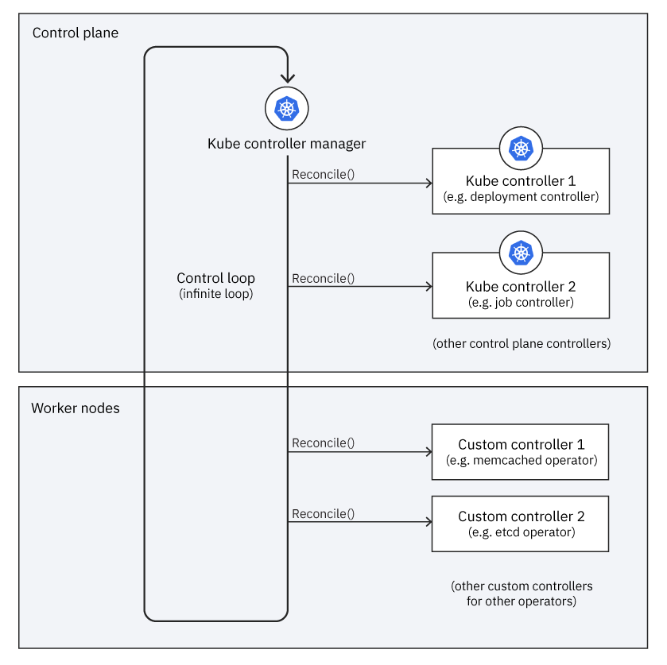

# Intro to Operators

This article will be the first in a series of articles and tutorials on learning how to build and deploy 
a Kubernetes Operator. 

This article will assume you have no knowledge on Kubernetes Operators, and will 
give you all of the basic knowledge needed to understand the different components and concepts of developing a
a Golang based operator. If you are already familiar with operators, you can either skim this article or 
simply skip ahead to the `SIMPLE_OPERATOR.md` file which shows how to develop and deploy your first operator to 
an OpenShift cluster.

## Expectations (What you have)
* You have little to no experience developing operators
* You have little to no knowledge on Kubernetes Operators concepts

## Expectations (What you want)
* You want to learn the basic concepts and steps needed to develop a Golang based operator to manage Kubernetes resources

## Estimated time
* This article should take roughly 15-30 minutes to complete, depending on how long you spend reading through 
documentation.

**To understand how Operators work at a high level, first we need to understand some of the basic features of how Kubernetes works**, features which Operators take advantage of.

### Workloads on Kubernetes

A "workload" is an application running on Kubernetes. Usually, this is done in as a `Deployment`. A [`Deployment`](https://kubernetes.io/docs/concepts/workloads/controllers/deployment/) runs a set of pod replicas which just ensures that a certain amount of pods are running at a given time. 

Once your application is running, you can make it available as a `Service`. A [`Service`](https://kubernetes.io/docs/concepts/services-networking/service/) is a way to expose an application running on a set of Pods as an endpoint, so that other client applications can invoke your 
service. 

## How Kubernetes works 
Each Kubernetes cluster consists of the components that make up the control plane (more on that later) and at least one worker machine 
called a `node`.  A node may be a physical or virtual machine. The worker nodes host the 
application workload in the form of Pods. More worker nodes on more computers provide more 
capacity for running workloads.

The [control plane](https://kubernetes.io/docs/reference/glossary/?all=true#term-control-plane) manages the worker nodes and Pods in your cluster.

### Control Plane Components

<!--  -->

The two control plane components that are very important for operator development are
the `kube-apiserver` (also known as API server or Kubernetes API) and the `kube-controller-manager`.
Whenever an admin works with a tool such as the 
`kubectl` CLI, the admin is using the `kube-apiserver` to tell the control plane to manage the cluster in a 
certain way. When we create a 
new operator, our new custom controller will be added
to the `kube-controller-manager's` control loop so that
it has the same core functionality as the other core 
Kubernetes controllers.

To learn more about control plane components, read from the [official Kubernetes documentation](https://kubernetes.io/docs/concepts/overview/components/#control-plane-components). 

## Controllers

A control loop is a loop which regulates the state of the system. **The control loop is the heart of Kubernetes and its declaritive system.** In Kubernetes, controllers are control 
loops that watch the current state of the cluster. Each controller tries to move the current
state closer to the desired state.

### Desired State and Current State
A cluster has two states: the desired (or expected) state, and the current state.

If those two states differ, the [controller](https://kubernetes.io/docs/concepts/architecture/controller/) will communicate with the API server
to create, delete, or update resources until the `current state` is the same as the `desired state`. Cluster administrators 
are able to change the desired state of the cluster by issuing commands such as `kubectl create` 
or `kubectl apply -f`.

**You will see `spec` used a lot throughout Kubernetes documentation and that refers to `desired state`. In turn, `status` refers to current state.** 

### Controller pattern
Each controller will watch one specific type of Kubernetes resource. Each resource will have a 
field called `spec` which is the `desired state` of that resource. When it comes to operators we will be using the controller pattern to create a custom controller and a custom resource, and have our controller watch our custom resource.

The controller for that resource is responsible for bringing the `current state`
to be closer (and eventually be equal) to the `desired state` using the API server. Read 
more about this topic [here](https://kubernetes.io/docs/concepts/architecture/controller/#controller-pattern).

### Kubernetes Design

Kubernetes uses lots of different controllers which each manage one aspect of the cluster. To align the current state with the desired state, the `kube-controller-manager` iterates through a set of controllers (Deployment controller, Job controller, etc.) in an infinite loop that detects how current state is different from desired state and adjusts current state to eliminate (attempt to eliminate) those differences. 

Controllers can act on core resources such as deployments or services, which are typically part of the Kubernetes controller manager in the control plane, or can watch and manipulate user-defined custom resources. The user-defined custom resources are what an operator helps manage. More on 
this soon.

## What are operators?
[Operators](https://kubernetes.io/docs/concepts/extend-kubernetes/operator/) are extensions to Kubernetes that make use of custom resources to manage applications and their 
components. 
They are used used to automate software config/maintenance activities that are typically done by human operators. That's why they are called operators.
Additionally, they are used to automate the software management lifecycle and they are extensible enough that they can be used to support life cycle management of stateful applications such as databases.

Read more about what operators from this [Red Hat blog](https://www.redhat.com/en/topics/containers/what-is-a-kubernetes-operator).

## What do operators do?

Operators extend the control plane by adding another controller to the control plane. Operators enable a developer to write custom controller logic to help manage 
a particular service, such as a database. 
 
## Why does Kubernetes need operators?

Kubernetes needs operators in order to automate tasks which are normally done manually by a 
SRE. Instead of having to set up multiple deployments, configmaps, secrets, and services, as 
an end user, you can just deploy your operator instead. Your operator will take care of everything
needed to make sure your service is up and running. The approach of using an operator is 
inherently easier, and scales better, than creating all of the deployments, configmaps, secrets, and services manually. 

## Custom Resource Definitions
A Custom Resource is how we can extend the Kubernetes API. A [Custom Resource Definition](https://kubernetes.io/docs/concepts/extend-kubernetes/api-extension/custom-resources/#customresourcedefinitions) is a 
type of resource in Kubernetes which defines a Custom Resource and all of the fields that 
are associated with a particular resource. 

When we develop an operator, we will use the SDK to create our API file, i.e. our `*_types.go` file.
The operator SDK has a utility function which will help us automatically generate CRD's from our 
API file. More on this in the next tutorial.

High-level configuration is inputted by the user in the CR, and then the operator takes 
whatever action is necessary as indicated by the custom controller logic (the reconcile function we will write in the next tutorial) to ensure the actual state matches the desired state. We 
can see 

### Custom Controllers (the code that watches your Custom Resource)

Like other controllers, Operators watch for a particular type of resource, which is defined 
in the Custom Resource Definition. Once a user inputs values into the custom resource, the 
desired state of the custom resource has changed. The Operator API signals to the Operator 
Controller that something has changed, so it will run its control loop to reconcile the changes.
From the picture above, you can see that the operator controller will have custom logic which 
will in turn call the Kube API to manage your particular service. The Kube API will in turn 
change the cluster's desired state to be what is specified by the Operator Controller. From
this point, all that happens in the cluster is the same that happens when an admin uses 
the `kubectl` command - the Kubernetes core controllers will act on the differences between
the current state and the desired state, and reconcile the differences. 

## Operator SDK

Operator SDK is an open source toolkit that provides tools to build, test and package operators. The SDK cli allows you to scaffold a project and also provides commands to generate code. It generates necessary files to bootstrap and extend to fit your use case. Also operator SDK makes use of `make`, a build automation tool, to build, test, package and deploy your operator through series of `make` commands that is provided in generated `Makefile`. The `Makefile` comes with pre-built commands like below which we will be using in our project.

* `manifests` generates manifests `yaml` definitions based on `kubebuilder` markers.
* `install` compiles your code and create executables.
* `generate` updates the generated code for based on your operator API schema.
* `docker-build` builds the operator docker image.
* `docker-push` pushes the operator docker image.
* `deploy` deploys all the resources to the cluster.
* `undeploy` deletes all the deployed resources from the cluster.

Operator SDK also allows you to install OLM (operator lifecycle manager) using `operator-sdk olm install` command. OLM is a set of cluster resources that manage the lifecycle of an Operator. Once installed, you can get the status of the OLM using `operator-sdk olm status`, to make sure all the resources in the cluster are in `installed` status.

## Conclusion
In this article, we learned about how operators can extend the base Kubernetes functionality 
by the use of custom controllers and CRDs. In the [next article](https://github.ibm.com/TT-ISV-org/operator/blob/220-kube-overview/SIMPLE_OPERATOR.md), we will develop and deploy 
an operator to the OpenShift container platform using the operator-sdk.

### Sources

The information in this article can be found in a few different sources:

* Kubernetes Operators by Jason Doies and Joshua Wood (O'Reilly)

* http://kublr.com/blog/understanding-kubernetes-operators

* https://kubernetes.io/docs/concepts/extend-kubernetes/operator/

* https://www.redhat.com/en/topics/containers/what-is-a-kubernetes-operator
