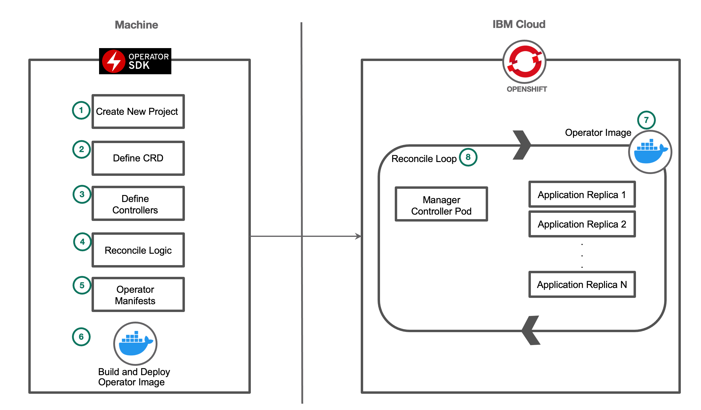
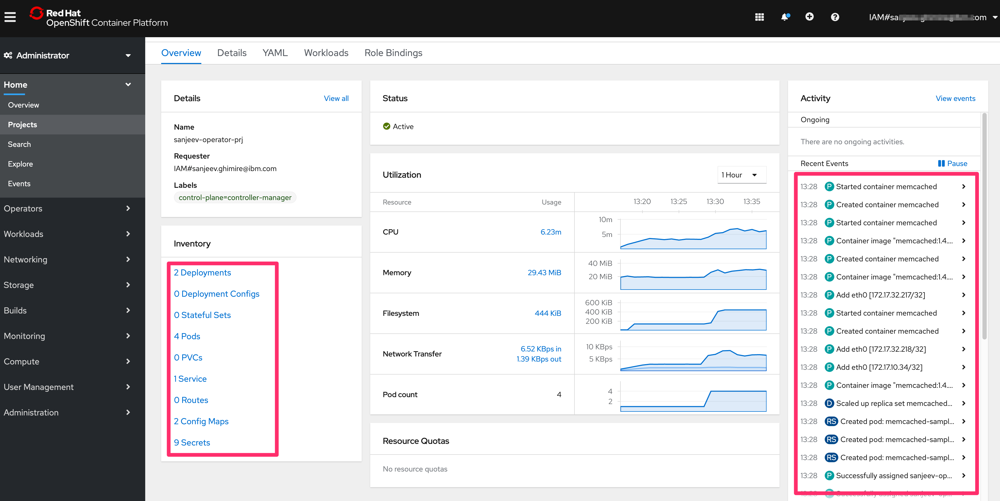

# Build a simple Golang-based operator

In this tutorial we will be creating a simple Go-based operator that walks you through an example of building a simple memcached-operator using operator-sdk.

Operators make it easy to manage complex stateful applications on top of Kubernetes or Openshift.

## Flow



1. Create a new operator project using the SDK Command Line Interface(CLI)
2. Define new resource APIs by adding Custom Resource Definitions(CRD)
3. Define Controllers to watch and reconcile resources
4. Write the reconciling logic for your Controller using the SDK and controller-runtime APIs
5. Use the SDK CLI to build and generate the operator deployment manifests
6. Use the SDK CLI to build operator docker image, push and deploy to OpenShift
7. Operator docker image is deployed to OpenShift cluster creating manager and application replicas.
8. Reconcile loop watches and heals the resources as needed.

## Pre-requisites
### Prerequisites for installing operator-sdk for macOS

To setup your environment for developing Golang-based operators, you'll need the 
following prerequisites installed on your machine. Note that the homebrew 
version is the easiest, but is only available for macOS.

* [Go](https://golang.org/dl/) 1.10+
* Access to a Kubernetes v1.11.3+ cluster (v1.16.0+ if using apiextensions.k8s.io/v1 CRDs). See [minikube](https://minikube.sigs.k8s.io/docs/start/) or [CodeReady Containers](https://code-ready.github.io/crc/#installing-codeready-containers_gsg) to access a cluster for free.
* User logged with admin permission. See how to grant yourself cluster-admin privileges or be logged in as admin.
* Access to a container registry such as [Quay.io](https://quay.io) or [DockerHub](https://hub.docker.com/)
* [Kustomize](https://kubectl.docs.kubernetes.io/installation/kustomize/homebrew/)
* Either OpenShift CLI [oc](https://docs.openshift.com/container-platform/4.5/cli_reference/openshift_cli/getting-started-cli.html) or [kubectl](https://kubernetes.io/docs/tasks/tools/install-kubectl/)

### Prerequisites for installing for Linux and Windows
* [dep](https://golang.github.io/dep/docs/installation.html) v0.5.0+
* [Git](https://git-scm.com/downloads)
* [Go](https://golang.org/dl/) v1.10+
* [Docker](https://docs.docker.com/get-docker/) v17.03+
* OpenShift CLI (oc) v4.1+ installed
* Access to a Kubernetes v1.11.3+ cluster (v1.16.0+ if using apiextensions.k8s.io/v1 CRDs). See [minikube](https://minikube.sigs.k8s.io/docs/start/) or [CodeReady Containers](https://code-ready.github.io/crc/#installing-codeready-containers_gsg) to access a cluster for free.
* Access to a container registry such as [Quay.io](https://quay.io) or [DockerHub](https://hub.docker.com/)
* [Kustomize](https://kubectl.docs.kubernetes.io/installation/kustomize/)

## Steps

1. [Install Operator SDK](#1-install-operator-sdk)
1. [Install oc or kubectl cli](#2-install-oc-or-kubectl-cli)
1. [Login to your cluster and create a new project](#3-login-to-your-cluster-and-create-a-new-project)
1. [Make sure OpenShift Lifecycle Manager (OLM) is up to date](#4-make-sure-openshift-lifecycle-manager-(olm)-is-up-to-date)
1. [Create a new project using Operator SDK](#5-create-a-new-project-using-operator-sdk)
1. [Scaffold your Custom Resource Definition(CRD) and Custom Controller code](#6-Scaffold-your-Custom-Resource-Definition(CRD)-and-Custom-Controller-code)
1. [Update your Custom Resource Definition(CRD)](#7-Update-your-Custom-Resource-Definition(CRD))
1. [Compile, build and push](#8-compile,-build-and-push)
1. [Deploy the operator](#9-deploy-the-operator)
1. [Test and verify](#10-test-and-verify)
1. [Cleanup](#11-cleanup)
## 1. Install Operator SDK
### Install operator-sdk (version 1.0+) and Kustomize for macOS

* Use the homebrew command `brew install operator-sdk`
to install operator-sdk for macOS. Note that this guide 
is tested for operator-sdk version 1.0+, since the commands have changed with the 1.0 release. 
 If you don't have homebrew 
installed, install it from [here](https://docs.brew.sh/Installation).

* Use the homebrew command `brew install kustomize` to install Kustomize.

### Install operator-sdk (version 1.0+) and Kustomize for Linux or Windows

* For Linux or Windows, install the operator-sdk (version 1.0+) from the GitHub release [here](https://sdk.operatorframework.io/docs/installation/#install-from-github-release). Note that
commands have changed with the 1.0 release.

* You can use the following script to install Kustomize for Windows or Linux but note that it doesn't work for ARM architecture. For ARM architecture download 
Kustomize from the [releases page](https://github.com/kubernetes-sigs/kustomize/releases).

```
curl -s "https://raw.githubusercontent.com/\
kubernetes-sigs/kustomize/master/hack/install_kustomize.sh"  | bash
```

### Test your environment for operator-sdk

Run the following command in the terminal of your choice:

```
operator-sdk version
```

You should see output like this:

```
operator-sdk version: "v1.3.0", commit: "1abf57985b43bf6a59dcd18147b3c574fa57d3f6", kubernetes version: "v1.19.4", go version: "go1.15.5", GOOS: "darwin", GOARCH: "amd64"
```

Now, let's ensure kustomize is installed.

```
kustomize version
```

You should see output like this:

```
{Version:kustomize/v3.9.1 GitCommit:7439f1809e5ccd4677ed52be7f98f2ad75122a93 BuildDate:2020-12-30T01:08:17+00:00 GoOs:darwin GoArch:amd64}
```

## 2. Install oc or kubectl cli
If you plan to use an OpenShift cluster, then you can install the OpenShift CLI via
your web console. Otherwise you can install kubectl from [here](https://kubernetes.io/docs/tasks/tools/install-kubectl/)

First, go to your OpenShift console and click on the question mark in the 
top-right corner. From there, click on `Command Line Tools` and then choose
the `oc` CLI binary for your operating system. Once you've downloaded it,
ensure that the command is in your `PATH`.

Test your cli by issuing the following command to see the version of your cli:

```
$ oc version
Client Version: openshift-clients-4.5.0-202006231303.p0-18-g6082e941e
Kubernetes Version: v1.19.2
```

## 3. Login to your cluster and create a new project

From the same console, you can see a section that says `Copy Login Command`. Use 
that command and paste that into your terminal to login to your cluster.

```
$ oc login --token=JhI**********P1lg --server=https://c****-e.us-south.containers.cloud.ibm.com:31047

Logged into "https://c****-e.us-south.containers.cloud.ibm.com:31047" as "IAM#horea.porutiu@ibm.com" using the token provided.

You have access to 72 projects, the list has been suppressed. You can list all projects with 'oc projects'
```

Next, create a new project by issuing the command

```
$ oc project <new-project-name>
```

You should see something like this:

```
$ oc project horea-demo-project
Now using project "horea-demo-project" on server "https://c***-e.us-south.containers.cloud.ibm.com:31047".
```

## 4. Make sure OpenShift Lifecycle Manager (OLM) is up to date

First, we need to take care of some cluster admin tasks. We will need to make sure our OpenShift Lifecycle Manager is 
up to date and running properly before we develop our operator. To do this, run the `operator-sdk olm status` command:

```
operator-sdk olm status

INFO[0003] Fetching CRDs for version "0.16.1"           
INFO[0003] Using locally stored resource manifests      
INFO[0005] Successfully got OLM status for version "0.16.1" 

NAME                                            NAMESPACE    KIND                        STATUS
operators.operators.coreos.com                               CustomResourceDefinition    Installed
operatorgroups.operators.coreos.com                          CustomResourceDefinition    Installed
installplans.operators.coreos.com                            CustomResourceDefinition    Installed
clusterserviceversions.operators.coreos.com                  CustomResourceDefinition    Installed
olm-operator                                    olm          Deployment                  Installed
subscriptions.operators.coreos.com                           CustomResourceDefinition    Installed
olm-operator-binding-olm                                     ClusterRoleBinding          Installed
operatorhubio-catalog                           olm          CatalogSource               Installed
olm-operators                                   olm          OperatorGroup               Installed
aggregate-olm-view                                           ClusterRole                 Installed
catalog-operator                                olm          Deployment                  Installed
aggregate-olm-edit                                           ClusterRole                 Installed
olm                                                          Namespace                   Installed
global-operators                                operators    OperatorGroup               Installed
operators                                                    Namespace                   Installed
packageserver                                   olm          ClusterServiceVersion       Installed
olm-operator-serviceaccount                     olm          ServiceAccount              Installed
catalogsources.operators.coreos.com                          CustomResourceDefinition    Installed
system:controller:operator-lifecycle-manager                 ClusterRole                 Installed
```

If you see something like the above, then your olm is up to date. Otherwise, you may need to upgrade 
your olm to the latest version. To do this, check out the troubleshooting section below.

Now you should be ready to start developing your first operator.

## 5. Create a new project using Operator SDK

First create a directory for where you will hold 
your project files. 

`mkdir $HOME/projects/memcached-operator`
`cd $HOME/projects/memcached-operator`

Since we are not in our $GOPATH, we can activate module support by running the 
`export GO111MODULE=on` command before using the operator-sdk.

Next, run the `operator-sdk init` command to create a new memcached-operator project:

```
$ operator-sdk init --domain=example.com --repo=github.com/example/memcached-operator
```

This will create the basic scaffold for your operator, such as the `bin`, `config` and `hack` directories, and will create the `main.go` file which initializes the manager. To 
learn more about the details of the architecture of the operator
refer to our article here.

## 6. Scaffold your Custom Resource Definition(CRD) and Custom Controller code

Next, we will use the `operator-sdk create api` command to create a blank custom resource definition,
or CRD which will be in your `api` directory and a blank custom controller file, which will be in your 
`controllers` directory.

We will use the --group, --version, and --kind flags to pass in the resource 
group and version. The <b>--group, --version, and --kind</b> flags together form the fully qualified name of a k8s resource type. This name must be unique across a cluster.

Make sure to type in `y` for both resource and controllers 
when prompted.

```
$ operator-sdk create api --group=cache --version=v1alpha1 --kind=Memcached
Create Resource [y/n]
y
Create Controller [y/n]
y
Writing scaffold for you to edit...
api/v1alpha1/memcached_types.go
controllers/memcached_controller.go
```

Now, once you deploy this operator, you can use the `kubectl api-resources` to see the name
`cache.example.com` as the api-group, and `Memcached` as the `Kind`. We can try this command 
later after we've deployed the operator.

## 7. Update your Custom Resource Definition(CRD)

One of the two main parts of the operator pattern is defining a Custom Resource Definition(CRD). We
will do that in the `api/v1alpha1/memcached_types.go` file.

To update our CRD, we will create three different structs in our 
CRD. One will be the overarching `Memcached struct`, which will have 
the `MemcachedStatus` and `MemcachedSpec` fields. Each of those structs,
i.e. the `MemcachedStatus struct` and the `MemcachedSpec struct` will each
have their own fields to describe the observed or current state and the 
desired state respectively.

In our `MemcachedSpec` struct, we are using an int to define the size of the deployment.
 When we create a custom resource later, we will  need to fill out the size, which is the number of `Memcached` replicas we want as the `desired state` of my system. 

The `MemcachedStatus` struct will use a string array to list the name of the memcached pods in the current state.

Lastly, the `Memcached` struct will have the fields `Spec` and `Status` to denote the desired state (spec) and the observed state (status). At a high-level, when the system recognizes there is a difference in the spec and the status, the operator will use custom controller logic defined in our 
`controllers/memcached_controller.go` file to update the 
system to be in the desired state.

Modify the `api/v1alpha1/memcached_types.go` to look like the following:

```go
// MemcachedSpec defines the desired state of Memcached
type MemcachedSpec struct {
	// +kubebuilder:validation:Minimum=0
	// Size is the size of the memcached deployment
	Size int32 `json:"size"`
}

// MemcachedStatus defines the observed state of Memcached
type MemcachedStatus struct {
	// Nodes are the names of the memcached pods
	Nodes []string `json:"nodes"`
}

// Memcached is the Schema for the memcacheds API
// +kubebuilder:subresource:status
type Memcached struct {
	metav1.TypeMeta   `json:",inline"`
	metav1.ObjectMeta `json:"metadata,omitempty"`

	Spec   MemcachedSpec   `json:"spec,omitempty"`
	Status MemcachedStatus `json:"status,omitempty"`
}
```

After modifying the memcached_types.go file run the following command to update the generated code for that resource type:

```
$ make generate
```

The above command will use the controller-gen utility in `bin/controller-gen` to update the api/v1alpha1/zz_generated.deepcopy.go file to ensure our API’s Go type definitions implement the `runtime.Object` interface that all Kind types must implement.

Once the API is defined with spec/status fields and CRD validation markers, the CRD manifests can be generated and updated with the following command:

```
$ make manifests
```

This command will invoke controller-gen to generate the CRD manifests at `config/crd/bases/cache.example.com_memcacheds.yaml`.

In the `cache.example.com_memcacheds.yaml` you can see the yaml representation 
of the object we specified in our `_types.go` file, specifically the MemcachedStatus
as an array of strings and the size of the MemchachedSpec as an int.

```yaml
- name: v1alpha1
    schema:
      openAPIV3Schema:
        description: Memcached is the Schema for the memcacheds API
        properties:
          apiVersion:
            description: 'APIVersion defines the versioned schema of this obj'
            type: string
          kind:
            type: string
          metadata:
            type: object
          spec:
            description: MemcachedSpec defines the desired state of Memcached
            properties:
              size:
                format: int32
                type: integer
            required:
            - size
            type: object
          status:
            description: MemcachedStatus defines the observed state of Memcached
            properties:
              nodes:
                items:
                  type: string
                type: array
            required:
            - nodes
            type: object
        type: object
```

Next, we will implement the custom controller logic which will tell the operator what to do in the case
that the desired state of the Memcached resource is not the same as the observed.

## 8. Compile, build and push

At this point, we are ready to compile and build the code and push the image to your image registry which in this case will be using Docker Hub. You can use your choice of mage registry. 

The generated code when you initialize creates a `Makefile` which allows you to use `make` command to compile your `go` operator code. The same make command also allows you to build and push the docker image.

To compile the code run the following command in the terminal from your project root:
```bash
make install
```

To buid the docker image run the following command. Note that you can also use the regular `docker build -t` command to build as well. Replace `<username>` and `<version>` as needed.

```bash
make docker-build IMG=docker.io/<username>/memcached-operator:<version>
```
 and finally push the docker image to your registry using following from your terminal:

 ```bash
make docker-push IMG=docker.io/<username>/memcached-operator:<version>

 ```

## 9. Deploy the operator

#### Deploy the operator to Openshift cluster

First provision an openshift cluster by going to `https://cloud.ibm.com/` and clicking `Red Hat OpenShift on Ibm Cloud` and get into 


Once you provisioned the cluster, select the cluster and go to `openshift web console` by clicking the button from top right corner of the page.


From the OpenShift web console, copy the login command from the account drop down menu.


and from your terminal run the command to login to your cluster.

If you haven't created a project, create a project by going to projects and clicking `Create Project`. From the terminal after you logged in change the project by running following in your terminal.

```bash
oc project <project name>

```

Make sure that the controller manager manifest has the right namespace and docker image. Apply the same to the default manifest as well by running following command:

```bash
cd config/manager
kustomize edit set image controller=${IMG}
cd ../../

cd config/default
kustomize edit set namespace "${NAMESPACE}"
cd ../../
```


To Deploy the operator run the following command from your terminal:

```bash
make deploy IMG=docker.io/<username>/memcached-operator:<version>
```

The output of the deployment should look like the following:
```bash
...go-workspace/src/memcached-operator/bin/controller-gen "crd:trivialVersions=true,preserveUnknownFields=false" rbac:roleName=manager-role webhook paths="./..." output:crd:artifacts:config=config/crd/bases
cd config/manager && ...go-workspace/src/memcached-operator/bin/kustomize edit set image controller=sanjeevghimire/memcached-operator:v0.0.5
.../go-workspace/src/memcached-operator/bin/kustomize build config/default | kubectl apply -f -
Warning: kubectl apply should be used on resource created by either kubectl create --save-config or kubectl apply
namespace/sanjeev-operator-prj configured
customresourcedefinition.apiextensions.k8s.io/memcacheds.cache.example.com configured
role.rbac.authorization.k8s.io/memcached-operator-leader-election-role created
clusterrole.rbac.authorization.k8s.io/memcached-operator-manager-role configured
clusterrole.rbac.authorization.k8s.io/memcached-operator-metrics-reader unchanged
clusterrole.rbac.authorization.k8s.io/memcached-operator-proxy-role unchanged
rolebinding.rbac.authorization.k8s.io/memcached-operator-leader-election-rolebinding created
clusterrolebinding.rbac.authorization.k8s.io/memcached-operator-manager-rolebinding configured
clusterrolebinding.rbac.authorization.k8s.io/memcached-operator-proxy-rolebinding configured
configmap/memcached-operator-manager-config created
service/memcached-operator-controller-manager-metrics-service created
deployment.apps/memcached-operator-controller-manager created
```

And finally create the custom resources using the following command:

```bash
$ kubectl apply -f config/samples/cache_v1alpha1_memcached.yaml
```

#### Verify that resources are Running

From the terminal run `oc get all` to make sure that controllers, managers and pods have been successfully created and is in `Running` state with the right number of pods as defined in the spec.

```bash
oc get all 

or

kubectl get all
```

Output:


Also from your cluster you can see the logs by going to your project in `OpenShift web console`



## 10. Test and verify

Update `config/samples/<group>_<version>_memcached.yaml` to change the `spec.size` field in the Memcached CR. This will increase te application pods from 3 to 5.

```bash
oc patch memcached memcached-sample -p '{"spec":{"size": 5}}' --type=merge
```

You can also update the spec.size from `OpenShift web console` by going to `Deployments` and selecting `memcached-sample` and increase/decrease using the up or down arrow:


## 11. Cleanup

The `Makefile` part of generated project has a target called `undeploy` which deletes all the resource. You can run following to cleanup all the resources:

```bash
make undeploy
```

## Troubleshooting

If you see errors when you run your `operator-sdk olm status` command, that may mean that you need to 
upgrade your olm. To do this, you should switch to the 
project in your OpenShift cluster where the olm is running.

```
oc project openshift-operator-lifecycle-manager
```

Then, you will need to update to the latest release of the olm, 
by first creating the crds

```
oc apply -f https://github.com/operator-framework/operator-lifecycle-manager/releases/download/0.16.1/crds.yaml
```

And then creating the olm itself:

```
oc apply -f https://github.com/operator-framework/operator-lifecycle-manager/releases/download/0.16.1/olm.yaml
```

# License

This code pattern is licensed under the Apache Software License, Version 2.  Separate third party code objects invoked within this code pattern are licensed by their respective providers pursuant to their own separate licenses. Contributions are subject to the [Developer Certificate of Origin, Version 1.1 (DCO)](https://developercertificate.org/) and the [Apache Software License, Version 2](https://www.apache.org/licenses/LICENSE-2.0.txt).

[Apache Software License (ASL) FAQ](https://www.apache.org/foundation/license-faq.html#WhatDoesItMEAN)
