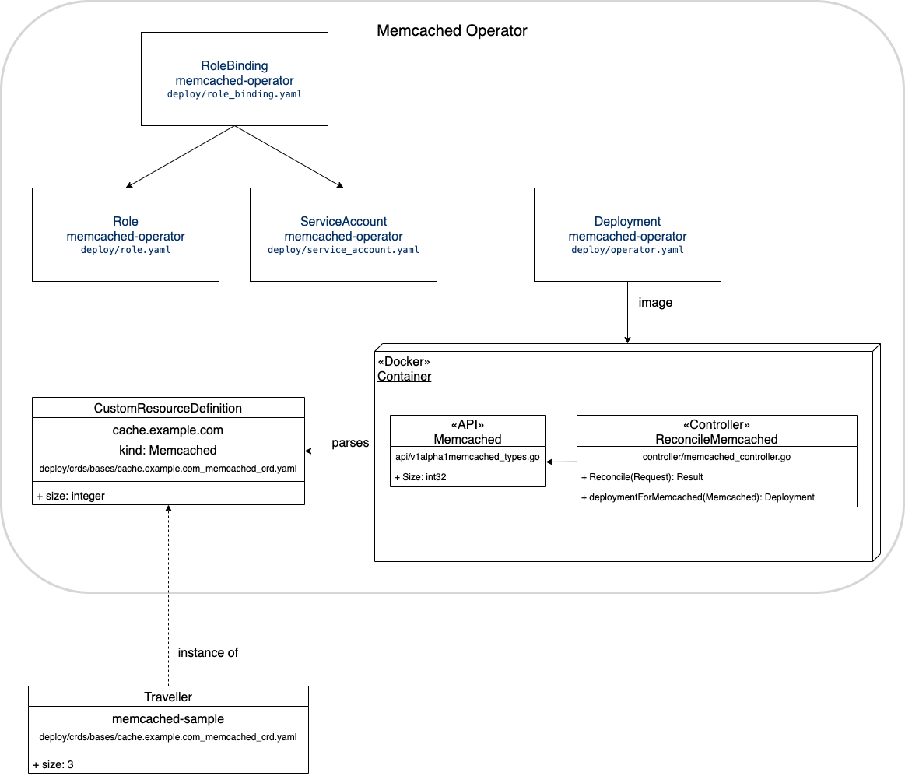
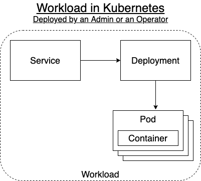
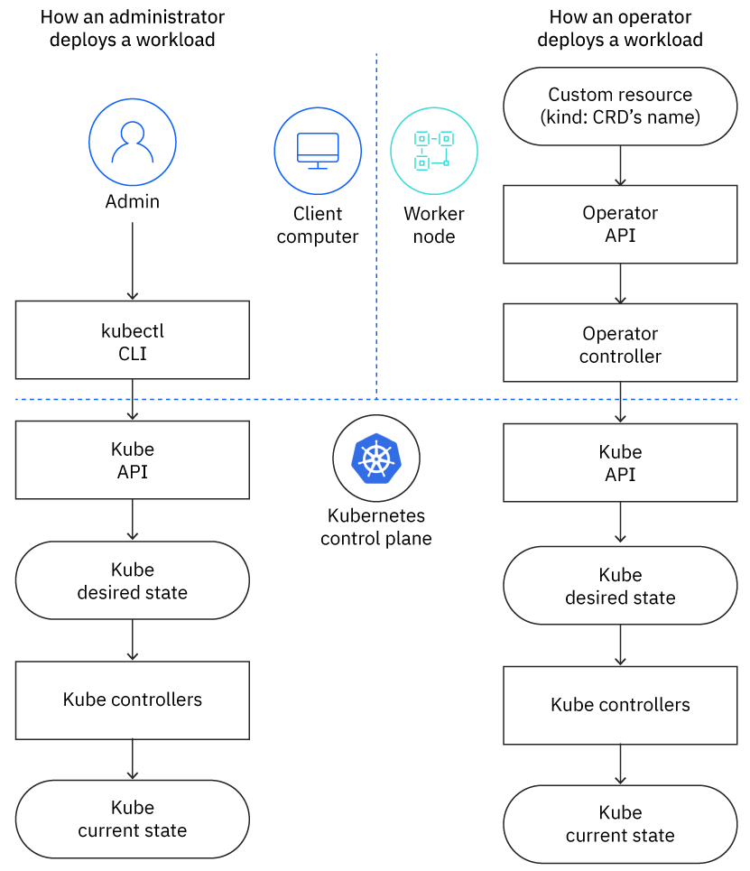
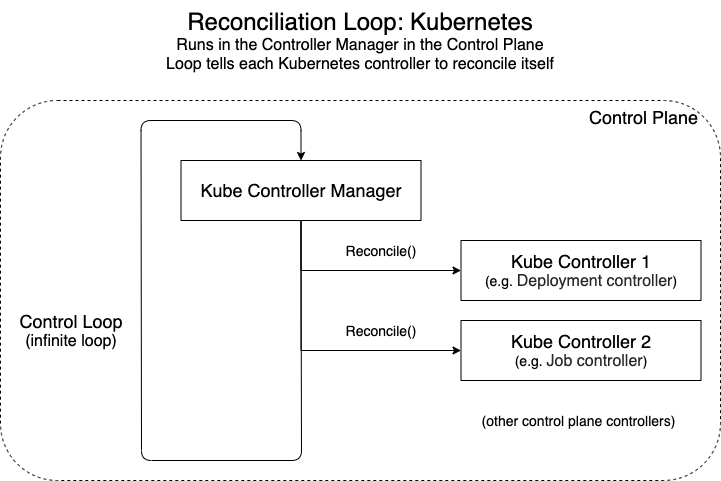
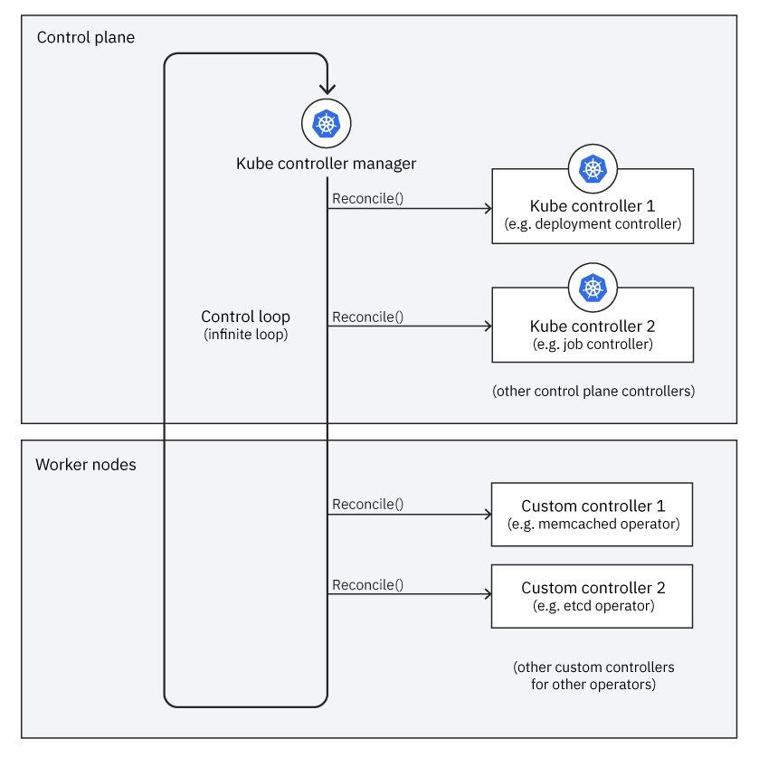
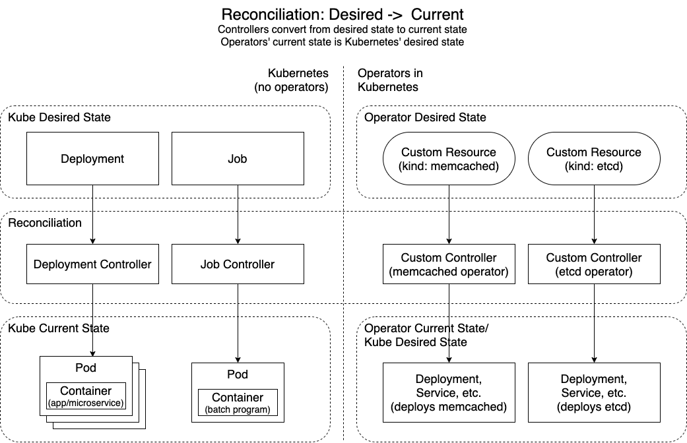

# Anatomy of an operator, demystified

## Introduction

Proponents of operators often describe them as having these two key advantages:
- Operators work the way Kubernetes does
- An operator extends Kubernetes

In this way, operators are the browser plugins of the Kubernetes world, adding custom functionality to Kubernetes' general functionality.

This article explains how operators work, using aspects of how a Kubernetes cluster works to illustrate that operators work similarly. It assumes that you are familiar with the concepts explained in [Intro to Operators](https://github.ibm.com/TT-ISV-org/operator/blob/main/INTRO_TO_OPERATORS.md) and want to understand how operators work in greater depth.

## Outline
1. [Operator Structure](#1-operator-Structure)
1. [Kubernetes architecture](#2-Kubernetes-architecture)
1. [Workload Deployment](#3-workload-deployment)
1. [Reconcile Loop](#4-Reconcile-Loop)
1. [Reconcile States](#5-Reconcile-States)

## 1. Operator Structure

As far as the Kubernetes cluster is concerned, an operator is just an application deployed as a workload. It's a very specialized application, designed to manage another resource, such as another application hosted in Kubernetes. An operator calls the resource that it manages its _operand_. It calls the Kubernetes objects that it uses to create the operand its _managed resources_.

Kubernetes out-of-the-box is pretty good at managing stateless workloads because all of them are similar enough that the same logic can be used to manage all of them. It has difficulty managing stateful workloads because they are more complex and each one is different, requiring custom management. An operator is a specialized application that provides custom management for specialized resources, often stateful workloads. 

A basic operator consists of the components depicted in this diagram:

These components form the three main parts of an operator:
- API -- The data that describes the operand's configuration, comprised of three parts:
  - Custom Resource Definition (CRD) -- The schema for yaml data that describes the operand
  - Programmatic API -- The same data schema as the CRD, implemented using the operator's programming language, such as Go
  - Custom Resource (CR) -- An instance of the CRD that describes an operand instance using the schema defined in the CRD
- Controller -- The brains of the operator, creates managed resources based on the description in the CR, implemented using the operator's programming language, such as Go
- RBAC Role and Service Account -- Kubernetes permissions that allow the controller to create the managed resources

A particular operator can be much more complex, but it will still contain this basic structure.

## 2. Kubernetes Architecture

Before we continue, let's quickly review how Kubernetes works. A [Kubernetes cluster](https://kubernetes.io/docs/concepts/overview/components/) consists of the components shown in this diagram:

These components form the main parts of a cluster:
- Worker nodes -- The computers that run the workloads
- Control plane -- The components that manage the cluster, its nodes and workloads
  - API server -- An API for the control plane, which clients use to manage the cluster
  - Controller manager -- Runs the controller processes; each controller has a specific responsibility as part of managing the cluster

There are other components that implement the cluster, but these are the ones an operator uses.

Because operators are specialized applications, they run in the worker nodes. Yet operators implement controllers, which usually run in the control plane. As we'll see, operators extend the control plane into the worker nodes.

A cluster's state is managed by [controllers](https://kubernetes.io/docs/concepts/architecture/controller/) reconciling the current state to match the desired state. A cluster always has two states: desired and current. Desired state represents objects that should exist in the cluster. Current state represents the objects that have been observed to actually exist. Controllers watch for changes in the desired state and then change the current state to make it look like the desired state. The controllers included with Kubernetes run in the control plane.

Almost every Kubernetes object includes two nested object fields that store the object's desired and current state, its specification (represented in yaml by the `spec` section) and its status (represented in yaml by the `status` section). These two fields are what an operator's controller uses to reconcile its operands. When we want to update the desired state, we update the settings in the specification field in the custom resource. After the cluster has updated the operand, we will [save the currently observed state of the managed resources in the status field](https://github.ibm.com/TT-ISV-org/operator/blob/main/INTERMEDIATE_TUTORIAL.md#update-the-status-to-save-the-current-state-of-the-cluster), thereby storing the custom resource's representation of the current state. 

## 3. Workload Deployment

The way an operator deploys and manages a workload is very similar to how an administrator deploys and manages a workload.

A very basic workload deployed into a Kubernetes cluster has this structure:

The workload consists of a Deployment that runs a set of Pod replicas, each of which runs a duplicate Container. The Deployment is exposed as a Service, which provides a single fixed endpoint for clients to invoke behavior in the set of replicas.

An operator deploys a workload in very much the same way that a human administrator (or a build pipeline) deploys a workload. As illustrated below, as far as the Kubernetes API is concerned, it does not know whether the client is an admin or an operator, and the cluster deploys the workload the same way.

An administrator uses client tools such as the `kubectl` CLI and YAML files to tell the cluster what to do, such as to deploy a workload. When an admin runs a command like `kubectl apply -f my-manifest.yaml`, what actually happens?
- The client tool talks to the Kube API, the interface for the control plane
- The API performs its commands by changing the cluster's desired state, such as adding a new resource described by `my-manifest.yaml`
- The controllers in the control plane make changes to the cluster's current state to make it match the desired state

Voilà, a workload is deployed.

When an operator deploys a workload, it does much the same thing:
- The custom resource (CR) acts like the administrator's YAML file, providing an abstract description of the resource that should be deployed
- The controller uses its API to read the CR and uses the Kube API to create the resource described by the CR, much like an admin running `kubectl` commands

The Kube API doesn't know whether its client is an admin using client tools or an operator running a controller. Either way, it performs the commands the client invokes by updating the desired state, which Kubernetes' controllers use to update the current state. In this way, the operator does what the admin would do, but in an automated way that's encapsulated in its controller's implementation.

## 4. Reconcile Loop

Earlier we explained that the Kubernetes control plane includes a controller manager and controllers. Let's examine what these do and how operators extend this.

The cluster is managed by a controller manager running controllers in a reconciliation loop in the control plane. Each controller is responsible for managing a specific part of the cluster's behavior. The controller manager runs a control loop that gives each controller an opportunity to run by invoking its `Reconcile()` method. When a controller reconciles, its task is to adjust the current state to make it match the desired state. Therefore, the control loop in the controller manager is a reconciliation loop, as illustrated in this diagram:

Whereas Kubernetes controllers run in the control plane, operators' controllers run in the worker nodes. This is because an operator is deployed into a Kubernetes cluster as a workload. Just like any other workload, the cluster hosts an operator's workload in the worker nodes.

Each operator extends the reconciliation loop by adding its custom controller to the controller manager's list of controllers:

When the controller manager runs the reconciliation loop, it not only tells each controller in the control plane to reconcile itself, it also tells each operator's custom controller to reconcile itself. As for a standard controller, reconcile is the custom controller's opportunity to react to any changes since the last time it reconciled itself.

Operators are said to extend Kubernetes, and the diagram illustrates this concept. In a cluster without operators, the reconciliation loop runs controllers in the control plane. Operators add more controllers to the reconciliation loop, thereby extending Kubernetes.

## 5. Reconcile States

Thus far, we've talked about the relationship between a cluster's desired state and its current state, and how a controller reconciles between those two states for the part of the cluster it manages. The way Kube controllers and operators' custom controllers reconcile is very analogous:

That said, the operator controllers work one level of abstraction higher than the Kube controllers. The Kube controllers reconcile built-in kinds like `Deployment` and `Job` into lower-level built-in kinds like `Pod`s. The custom controllers reconcile CRDs like `Memcached` and `Etcd` into workload kinds like `Deployment` and `Service`. So a custom controller's current state becomes a Kube controller's desired state. So both kinds of controllers reconcile between desired and current state, <b>but with operators</b> there are three layers of state to adjust between: operators' custom resources reconcile to the cluster's desired state which reconciles to the cluster's current state.

## Conclusion

This article has shown how operators work the way Kubernetes does and extends a cluster to custom manage specialized resources. Operators work like Kubernetes in several aspects:
- The brains of an operator is a controller whose responsibilities are very much like those of a controller in the control plane
- The way an operator deploys a workload is very much like how an administrator deploys a workload; the control plane doesn't know the difference
- The control plane implements a reconciliation loop that gives each controller an opportunity to reconcile itself, and operators add their controllers to that loop
- Both Kube controllers and custom controllers adjust between their desired state and their current state, but operators manage desired state as CRs and reconcile it into current state that is managed resources that Kube controllers use as desired state

With this understanding, you'll be better prepared to write your own operators and understand how they work as a part of Kubernetes.
