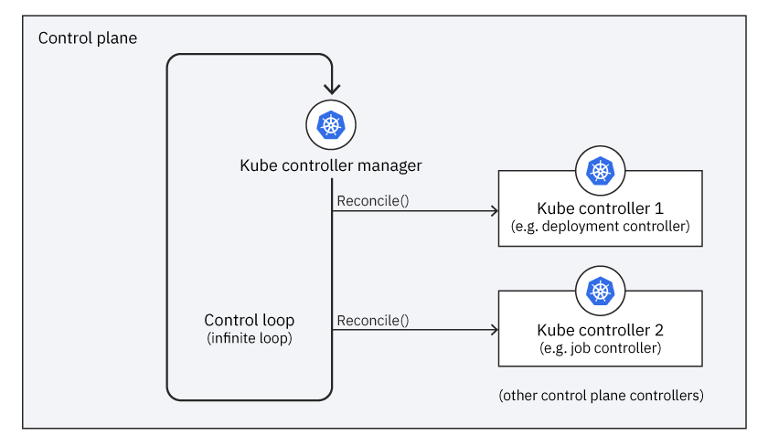

# Kubernetes operators, explained

## Anatomy of an operator, demystified

## Introduction

An advantage to using operators is that they extend the way Kubernetes already works. Think of operators as the browser plugins of the Kubernetes world, adding custom functionality to Kubernetes' general functionality.

This article is an in-depth look at operators. We review the operator structure and then use aspects of how a Kubernetes cluster works to highlight how you can extend your knowledge of Kubernetes easiliy to operators. This article builds on the concepts explained in [Intro to Operators](https://github.ibm.com/TT-ISV-org/operator/blob/main/INTRO_TO_OPERATORS.md).

## Operator structure

To a Kubernetes cluster, an operator is an application deployed as a workload. This specialized application manages another resource, such as another application hosted in Kubernetes. An operator manages an *operand* using a set of *managed resources*:

* Operand: the managed resource that the operator provides as a service
* Managed resource: the Kubernetes objects that an operator uses to create the operand

Out-of-the-box Kubernetes is good at managing [stateless workloads](https://12factor.net/processes) and these workloads are similar enough that Kubernetes uses the same logic to manage all of them. Stateful workloads are more complex and each one is different, requiring custom management. Operators provide this custom management for stateful workloads. 

A basic operator consists of the components depicted in this diagram:

These components form the three main parts of an operator:

- API: The data that describes the operand's configuration. The API is made up of three parts:
  - Custom resource definition (CRD): Defines a schema of settings available for configuring the operand
  - Programmatic API: Defines the same data schema as the CRD, implemented using the operator's programming language, such as Go
  - Custom resource (CR): An instance of the CRD that specifies values for the settings defined by the CRD; these values describe the configuration of an operand.
- Controller: The brains of the operator, the controller creates managed resources based on the description in the custom resource. Controllers are implemented using the operator's programming language, such as Go.
- Role and service account: Kubernetes RBAC resources with permissions that allow the controller to create the managed resources

A particular operator can be much more complex, but it will still contain this basic structure.

## Kubernetes architecture

Before going deeper with operators, let's review how Kubernetes works, so I can relate it to how operators work. A [Kubernetes cluster](https://kubernetes.io/docs/concepts/overview/components/) consists of the components shown in this diagram:

These components form the main parts of a cluster:

- Worker nodes: The computers that run the workloads
- Control plane: The components that manage the cluster, its nodes, and workloads
  - API server: An API for the control plane which clients use to manage the cluster
  - Controller manager: Runs the controller processes; each controller has a specific responsibility as part of managing the cluster

There are other components that implement the cluster, but these are the ones an operator uses.

Because operators are specialized applications, they run in the worker nodes. Yet operators implement controllers, which usually run in the control plane. Because operators run controllers in the worker nodes, they effectively extend the control plane into the worker nodes.

A cluster always has two states: desired and current. The *desired state* represents objects that should exist in the cluster. The *current state* represents the objects that actually exist. [Controllers](https://kubernetes.io/docs/concepts/architecture/controller/) manage a cluster's state, reconciling the current state to match the desired state. Kubernetes' controllers run in the control plane.

Almost every Kubernetes object includes two nested object fields that store the objects' desired and current state, specification (represented in YAML by the `spec` section), and status (represented in YAML by the `status` section). These two fields are what an operator's controller uses to reconcile its operands. When you want to update the desired state, you update the settings in the specification field in the custom resource. After the cluster has updated the operand, the controller will [save the currently observed state of the managed resources in the status field](https://github.ibm.com/TT-ISV-org/operator/blob/main/INTERMEDIATE_TUTORIAL.md#update-the-status-to-save-the-current-state-of-the-cluster), thereby storing the custom resource's representation of the current state. 

## Workload deployment in Kubernetes

The way an operator deploys and manages a workload is similar to how an administrator deploys and manages a workload. A basic workload deployed into a Kubernetes cluster has this structure:

The workload consists of a Deployment that runs a set of Pod replicas, each of which runs a duplicate Container. The Deployment is exposed as a Service, which provides a single fixed endpoint for clients to invoke behavior in the set of replicas.

### How operators deploy a worklaod

An operator deploys a workload in very much the same way that a human administrator (or a build pipeline) deploys a workload. As illustrated below, as far as the Kubernetes API is concerned, it does not know whether the client is an admin or an operator, and the cluster deploys the workload the same way.

An administrator uses client tools such as the `kubectl` CLI and YAML files to tell the cluster what resources to create, such as those to deploy a workload. When an admin runs a command like `kubectl apply -f my-manifest.yaml`, what actually happens?

- The client tool talks to the Kube API, which is the interface for the control plane
- The API performs its commands by changing the cluster's desired state, such as adding a new resource described by `my-manifest.yaml`
- The controllers in the control plane make changes to the cluster's current state to make it match the desired state

Voilà, a workload is deployed.

When an operator deploys a workload, it does much the same thing:

- The custom resource (CR) acts like the administrator's YAML file, providing an abstract description of the resource that should be deployed.
- The controller uses its API to read the CR and uses the Kube API to create the resource described by the CR, much like an admin running `kubectl` commands.

The Kube API doesn't know whether its client is an admin using client tools or an operator running a controller. Either way, it performs the commands the client invokes by updating the desired state, which Kubernetes' controllers use to update the current state. In this way, the operator does what the admin would do, but in an automated way that's encapsulated in its controller's implementation.

## Reconciliation loop

Let's examine the controller manager and controllers in Kubernetes' control plane and see how operators extend them.

### Reconciliation loop is implemented in the control plane

The Kubernetes cluster is managed by a controller manager that runs controllers in a reconciliation loop in the control plane. Each controller is responsible for managing a specific part of the cluster's behavior. The controller manager runs a control loop that gives each controller an opportunity to run by invoking its `Reconcile()` method. When a controller reconciles, its task is to adjust the current state to make it match the desired state. Therefore, the control loop in the controller manager is a reconciliation loop, as this diagram shows:

### Reconciliation loop with operators extends into the worker nodes

While Kubernetes controllers run in the control plane, operators' controllers run in the worker nodes. This is because an operator is deployed into a Kubernetes cluster as a workload. Just like any other workload, the cluster hosts an operator's workload in the worker nodes.

Each operator extends the reconciliation loop by adding its custom controller to the controller manager's list of controllers:

When the controller manager runs the reconciliation loop, it not only tells each controller in the control plane to reconcile itself, it also tells each operator's custom controller to reconcile itself. Just like for a standard controller, `Reconcile()` is the custom controller's opportunity to react to any changes since the last time it reconciled itself.

Operators are said to extend Kubernetes, and the diagram illustrates this concept. In a cluster without operators, the reconciliation loop runs controllers in the control plane. Operators add more controllers to the reconciliation loop, thereby extending Kubernetes.

## Reconcile states

Thus far, we've talked about the relationship between a cluster's desired state and its current state, and how a controller reconciles between those two states for the part of the cluster it manages. The way Kube controllers and operators' custom controllers reconcile is analogous:

Operator controllers work one level of abstraction higher than the Kube controllers. The Kube controllers reconcile built-in kinds like `Deployment` and `Job` into lower-level built-in kinds like `Pod`s. Custom controllers reconcile CRDs like `Memcached` and `Etcd` into workload kinds like `Deployment` and `Service`. So, a custom controller's current state becomes a Kube controller's desired state. 

Both kinds of controllers reconcile between desired and current state, <b>operators adjust between three states</b>: operators' custom resources reconcile to the cluster's desired state which reconciles to the cluster's current state.

## Conclusion

Hopefully this article has helped you understand that operators work the way Kubernetes does and extend a cluster to custom manage specialized resources. Operators work like Kubernetes in several aspects:

- The brains of an operator is a controller whose responsibilities are like those of a controller in the control plane.
- The way an operator deploys a workload is similar to how an administrator deploys a workload; the control plane doesn't know the difference.
- The control plane implements a reconciliation loop that gives each controller an opportunity to reconcile itself, and operators add their controllers to that loop.
- While Kube controllers and custom controllers adjust between their desired state and their current state, operators manage desired state as a custom resource and reconcile it into a current state that is a set of managed resources that Kube controllers use as their desired state.

With this understanding, you'll be better prepared to write your own operators and understand how they work as a part of Kubernetes.
