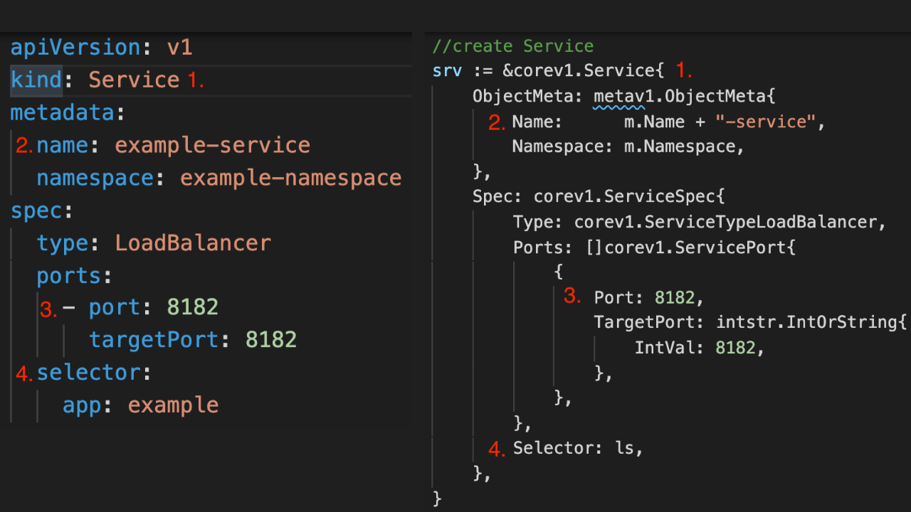
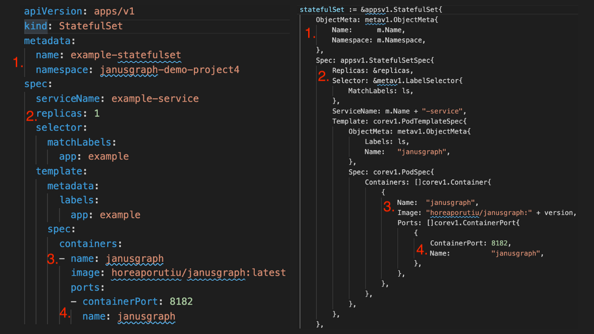

# Develop and Deploy a Level 1 JanusGraph Operator on OpenShift Container Platform
In this article, we will discuss how to develop and deploy a Level 1 operator on the OpenShift Container Platform. We will use the 
[Operator SDK Capability Levels](https://operatorframework.io/operator-capabilities/) as our guidelines for what is considered a 
level 1 operator.

### Develop and Deploy a Level 1 JanusGraph Operator using BerkeleyDB - Part 1
In part 1 of the tutorial, we will deploy JanusGraph using the default backend storage (BerkeleyDB). 
This is much more simple to deploy, since it will only use one Pod, and doesn't use any persistent volumes to our cluster. This approach is really only recommended for 
testing purposes, as noted in the [JanusGraph docs](https://docs.janusgraph.org/storage-backend/bdb/).
This approach will be much easier and quicker to get up and running, so we will start with this approach. Once we've gotten this approach working, we will move on to a more advanced approach (Part 2), using Cassandra as the backend storage.

### Develop and Deploy a Level 1 JanusGraph Operator using Cassandra - Part 2
In part 2 of the tutorial, we will update our operator to use Cassandra as the backend storage. 
This will enable use to replicate our data across multiple Pods, and give us high availability.  

## Expectations (What you have)
* You have some experience developing operators
* You've finished the beginner and intermediate tutorials in this learning path, including  [Develop and Deploy a Memcached Operator on OpenShift Container Platform](https://github.ibm.com/TT-ISV-org/operator/blob/main/BEGINNER_TUTORIAL.md)
* You've read articles and blogs on the basic idea of a Kubernetes Operators, and you know the basic Kubernetes resource types

## Expectations (What you want)
* You want deep technical knowledge of how to implement a Level 1 operator

## Prerequisites
* You've completed the [environment setup](https://github.ibm.com/TT-ISV-org/operator/blob/main/installation.md)
* You have some knowledge of Kubernetes Operators concepts
* You've created [Memcached Operator](https://github.ibm.com/TT-ISV-org/operator/blob/main/BEGINNER_TUTORIAL.md)
* You've read [Deep Dive into Memcached Operator Code](https://github.ibm.com/TT-ISV-org/operator/blob/main/INTERMEDIATE_TUTORIAL.md)

## Steps
0. [Overview](#0-overview)
1. [Create the JanusGraph project and API ](#1-Create-the-JanusGraph-project-and-API )
1. [Update the JanusGraph API](#2-Update-the-janusgraph-API)
1. [Controller Logic: Creating a Service](#3-controller-logic-creating-a-service)
1. [Controller Logic: Creating a StatefulSet](#4-controller-logic-creating-a-statefulset)
1. [Update the user and the custom resource](#5-Update-the-user-and-the-custom-resource)
1. [Build, push, and deploy your operator](#6-Build-push-and-deploy-your-operator)
1. [Verify operator](#7-verify-operator)

## 0. Overview

### What is a Level 1 Operator? 

According to the Operator Capability Levels, a Level 1 Operator is one which has ["automated application provisioning and configuration management"](https://sdk.operatorframework.io/docs/advanced-topics/operator-capabilities/operator-capabilities/#level-1---basic-install). 

### Requirements for Level 1 Operator

Your operator should have the following features to be qualified as a Level 1 Operator:

* Provision an application through a custom resource
* Allow **all** installation configuration details to be specified in the `spec` section of the CR 
* Should be possible to install the operator in multiple ways (kubectl, OLM, OperatorHub)
* All configuration files should be able to be created within Kubernetes 
* The operator must wait for the operand to reach a healthy state
* The operator must use the `status` subresource of the custom resource to communicate with the user when the operand or application has reconciled

### JanusGraph example 

Now that we understand at a high-level what an operator must do to be considered level 1, 
let's dive into our example. 

In our article, we will use JanusGraph as the example of the service we want to to create an
operator for. Currently, there is no JanusGraph operator on OperatorHub (as of March 23, 2021).
[JanusGraph](https://janusgraph.org/) is a distributed, open source, scalable graph database. 

**Important: JanusGraph is an example. The main ideas learned from JanusGraph are meant to be applied to any application or service you want to create an operator for.** 

### JanusGraph operator w/ BerkeleyDB requirements

With that aside, let's understand what the JanusGraph operator must to do to successfully run JanusGraph on OpenShift. More specifically, we will show how 
to implement the below changes in the controller code which will run each time a change to the custom resource is observed. 

1. Create a Service if one does not exist.
2. Create a StatefulSet if ones does not exist.
3. Update the status

These are the only two resources that our operator must create in order to get the default 
JanusGraph configuration (using BerkeleyDB) up and running. More specifically, a [StatefulSet needs to have a headless service](https://kubernetes.io/docs/concepts/workloads/controllers/statefulset/#limitations) to be responsible for the network identity of the Pods. 

### What is a StatefulSet
A [StatefulSet](https://kubernetes.io/docs/concepts/workloads/controllers/statefulset/) is the object that is used to manage stateful applications. 
Similar to a [Deployment](https://kubernetes.io/docs/concepts/workloads/controllers/deployment/), a StatefulSet manages pods that are based on an identical container spec. The difference is that in a 
Deployment, pods are interchangeable. But in a StatefulSet, they are not - each has a unique identifier that
is maintained across any rescheduling. 

## 1. Create the JanusGraph project and API  

At this point, we are familiar with using the Operator SDK to scaffold an operator for us. 

First, let's create our project directory: 

```bash
mkdir $HOME/projects/janusgraph-operator
cd $HOME/projects/janusgraph-operator
```

Next, let's create our project:

```bash
operator-sdk init --domain=example.com --repo=github.com/example/janusgraph-operator
```

For Go Modules to work properly, make sure you activate GO module support by running the following command:

```bash
export GO111MODULE=on
```

Now, create the API, with the `kind` being `Janusgraph`:

```bash
operator-sdk create api --group=graph --version=v1alpha1 --kind=Janusgraph --controller --resource
```

You should see output like: 

```
Writing scaffold for you to edit...
api/v1alpha1/janusgraph_types.go
controllers/janusgraph_controller.go
Running make:
...
```

## 2. Update the JanusGraph API

Next, let's update the API. Your `janusgraph_types.go` file should look like the following:

```go
package v1alpha1

import (
	metav1 "k8s.io/apimachinery/pkg/apis/meta/v1"
)

// EDIT THIS FILE!  THIS IS SCAFFOLDING FOR YOU TO OWN!
// NOTE: json tags are required.  Any new fields you add must have json tags for the fields to be serialized.

// JanusgraphSpec defines the desired state of Janusgraph
type JanusgraphSpec struct {
	// INSERT ADDITIONAL SPEC FIELDS - desired state of cluster
	// Important: Run "make" to regenerate code after modifying this file

	// Foo is an example field of Janusgraph. Edit Janusgraph_types.go to remove/update
	Size    int32  `json:"size"`
	Version string `json:"version"`
}

// JanusgraphStatus defines the observed state of Janusgraph
type JanusgraphStatus struct {
	// INSERT ADDITIONAL STATUS FIELD - define observed state of cluster
	// Important: Run "make" to regenerate code after modifying this file
	Nodes []string `json:"nodes"`
}

// +kubebuilder:object:root=true
// +kubebuilder:subresource:status

// Janusgraph is the Schema for the janusgraphs API
type Janusgraph struct {
	metav1.TypeMeta   `json:",inline"`
	metav1.ObjectMeta `json:"metadata,omitempty"`

	Spec   JanusgraphSpec   `json:"spec,omitempty"`
	Status JanusgraphStatus `json:"status,omitempty"`
}

// +kubebuilder:object:root=true

// JanusgraphList contains a list of Janusgraph
type JanusgraphList struct {
	metav1.TypeMeta `json:",inline"`
	metav1.ListMeta `json:"metadata,omitempty"`
	Items           []Janusgraph `json:"items"`
}

func init() {
	SchemeBuilder.Register(&Janusgraph{}, &JanusgraphList{})
}
```

As shown above, we've added the `Size` and `Version` fields to the `Spec`. We've also added the `Spec` and `Status` fields to the `Janusgraph` struct. This 
should be familiar to you if you've completed the [Develop and Deploy a Memcached Operator on OpenShift Container Platform](https://github.ibm.com/TT-ISV-org/operator/blob/main/BEGINNER_TUTORIAL.md) tutorial. If you have not, that tutorial will offer more details about using the Operator SDK.

## 3. Controller Logic: Creating a Service

<b>Note: If you want to learn more in depth about the controller logic that is written here,
please view our [Deep dive into Memcached Operator Code](https://github.ibm.com/TT-ISV-org/operator/blob/main/INTERMEDIATE_TUTORIAL.md) article.</b>

Now that we have our API updated, our next step is to implement our controller logic in `controllers/janusgraph_controller.go`. First, go ahead and copy the code from the 
[artifacts/janusgraph_controller.go](https://github.ibm.com/TT-ISV-org/operator/blob/main/artifacts/janusgraph_controller.go) file, and replace your current controller code.

Once this is complete, your controller should look like the following:

```go
package controllers

import (
	"context"
	"reflect"

	"github.com/go-logr/logr"
	appsv1 "k8s.io/api/apps/v1"
	corev1 "k8s.io/api/core/v1"
	"k8s.io/apimachinery/pkg/api/errors"
	metav1 "k8s.io/apimachinery/pkg/apis/meta/v1"
	"k8s.io/apimachinery/pkg/runtime"
	"k8s.io/apimachinery/pkg/types"
	"k8s.io/apimachinery/pkg/util/intstr"
	ctrl "sigs.k8s.io/controller-runtime"
	"sigs.k8s.io/controller-runtime/pkg/client"

	graphv1alpha1 "github.com/example/janusgraph-operator/api/v1alpha1"
)

// JanusgraphReconciler reconciles a Janusgraph object
type JanusgraphReconciler struct {
	client.Client
	Log    logr.Logger
	Scheme *runtime.Scheme
}

// +kubebuilder:rbac:groups=graph.example.com,resources=janusgraphs,verbs=get;list;watch;create;update;patch;delete
// +kubebuilder:rbac:groups=graph.example.com,resources=janusgraphs/status,verbs=get;update;patch
// +kubebuilder:rbac:groups=graph.example.com,resources=janusgraphs/finalizers,verbs=update
// +kubebuilder:rbac:groups=apps,resources=pods;deployments;statefulsets;services;persistentvolumeclaims;persistentvolumes;,verbs=get;list;watch;create;update;patch;delete
// +kubebuilder:rbac:groups=core,resources=pods;services;persistentvolumeclaims;persistentvolumes;,verbs=get;list;create;update;watch

// Reconcile is part of the main kubernetes reconciliation loop which aims to
// move the current state of the cluster closer to the desired state.
// TODO(user): Modify the Reconcile function to compare the state specified by
// the Janusgraph object against the actual cluster state, and then
// perform operations to make the cluster state reflect the state specified by
// the user.
//
// For more details, check Reconcile and its Result here:
// - https://pkg.go.dev/sigs.k8s.io/controller-runtime@v0.7.0/pkg/reconcile
func (r *JanusgraphReconciler) Reconcile(ctx context.Context, req ctrl.Request) (ctrl.Result, error) {
	log := r.Log.WithValues("janusgraph", req.NamespacedName)

	// Fetch the Janusgraph instance
	janusgraph := &graphv1alpha1.Janusgraph{}
	err := r.Get(ctx, req.NamespacedName, janusgraph)
	if err != nil {
		if errors.IsNotFound(err) {
			// Request object not found, could have been deleted after reconcile request.
			// Owned objects are automatically garbage collected. For additional cleanup logic use finalizers.
			// Return and don't requeue
			log.Info("Janusgraph resource not found. Ignoring since object must be deleted")
			return ctrl.Result{}, nil
		}
		// Error reading the object - requeue the request.
		log.Error(err, "Failed to get Janusgraph")
		return ctrl.Result{}, err
	}

	// fetch Service resource
	serviceFound := &corev1.Service{}
	log.Info("Checking for service")
	//check for Service resources in our namespace, and with a "JanusGraph" name prefix
	err = r.Get(ctx, types.NamespacedName{Name: janusgraph.Name + "-service", Namespace: janusgraph.Namespace}, serviceFound)
	if err != nil && errors.IsNotFound(err) {
		srv := r.serviceForJanusgraph(janusgraph)
		log.Info("Creating a new headless service", "Service.Namespace", srv.Namespace, "Service.Name", srv.Name)
		err = r.Create(ctx, srv)
		if err != nil {
			log.Error(err, "Failed to create new service", "service.Namespace", srv.Namespace, "service.Name", srv.Name)
			return ctrl.Result{}, err
		}
		// Service created successfully - return and requeue
		log.Info("Janusgraph service created, requeuing")
		return ctrl.Result{Requeue: true}, nil
	} else if err != nil {
		log.Error(err, "Failed to get service")
		return ctrl.Result{}, err
	}

	// look for a resource of type StatefulSet
	found := &appsv1.StatefulSet{}
	// Check if the StatefulSet already exists in our namespace, if not create a new one
	err = r.Get(ctx, types.NamespacedName{Name: janusgraph.Name, Namespace: janusgraph.Namespace}, found)
	if err != nil && errors.IsNotFound(err) {
		// Define a new StatefulSet
		statefulSet := r.statefulSetForJanusgraph(janusgraph)
		log.Info("Creating a new Statefulset", "StatefulSet.Namespace", statefulSet.Namespace, "StatefulSet.Name", statefulSet.Name)
		err = r.Create(ctx, statefulSet)
		if err != nil {
			log.Error(err, "Failed to create new StatefulSet", "StatefulSet.Namespace", statefulSet.Namespace, "StatefulSet.Name", statefulSet.Name)
			return ctrl.Result{}, err
		}
		// StatefulSet created successfully - return and requeue
		log.Info("StatefulSet created, requeuing")
		return ctrl.Result{}, nil
	} else if err != nil {
		log.Error(err, "Failed to get StatefulSet")
		return ctrl.Result{}, err
	}

	// look for resource of type PodList
	podList := &corev1.PodList{}
	//create filter to check for Pods only in our Namespace with the correct matching labels
	listOpts := []client.ListOption{
		client.InNamespace(janusgraph.Namespace),
		client.MatchingLabels(labelsForJanusgraph(janusgraph.Name)),
	}
	//List all Pods that match our filter (same Namespace and matching labels)
	if err = r.List(ctx, podList, listOpts...); err != nil {
		log.Error(err, "Failed to list pods", "Janusgraph.Namespace", janusgraph.Namespace, "Janusgraph.Name", janusgraph.Name)
		return ctrl.Result{}, err
	}
	//return an array of pod names
	podNames := getPodNames(podList.Items)

	// Update the status of our JanusGraph object to show Pods which were returned from getPodNames
	if !reflect.DeepEqual(podNames, janusgraph.Status.Nodes) {
		janusgraph.Status.Nodes = podNames
		err := r.Status().Update(ctx, janusgraph)
		if err != nil {
			log.Error(err, "Failed to update Janusgraph status")
			return ctrl.Result{}, err
		}
	}

	return ctrl.Result{}, nil
}

// getPodNames returns a string array of Pod Names
func getPodNames(pods []corev1.Pod) []string {
	var podNames []string
	for _, pod := range pods {
		podNames = append(podNames, pod.Name)
	}
	return podNames
}

// SetupWithManager sets up the controller with the Manager.
func (r *JanusgraphReconciler) SetupWithManager(mgr ctrl.Manager) error {
	return ctrl.NewControllerManagedBy(mgr).
		For(&graphv1alpha1.Janusgraph{}).
		Complete(r)
}

// labelsForJanusgraph returns a map of string keys and string values
func labelsForJanusgraph(name string) map[string]string {
	return map[string]string{"app": "Janusgraph", "janusgraph_cr": name}
}

// serviceForJanusgraph returns a Load Balancer service for our JanusGraph object
func (r *JanusgraphReconciler) serviceForJanusgraph(m *graphv1alpha1.Janusgraph) *corev1.Service {

	//fetch labels
	ls := labelsForJanusgraph(m.Name)
	//create Service
	srv := &corev1.Service{
		ObjectMeta: metav1.ObjectMeta{
			Name:      m.Name + "-service",
			Namespace: m.Namespace,
		},
		Spec: corev1.ServiceSpec{
			Type: corev1.ServiceTypeLoadBalancer,
			Ports: []corev1.ServicePort{
				{
					Port: 8182,
					TargetPort: intstr.IntOrString{
						IntVal: 8182,
					},
				},
			},
			Selector: ls,
		},
	}
	ctrl.SetControllerReference(m, srv, r.Scheme)
	return srv
}

// statefulSetForJanusgraph returns a StatefulSet for our JanusGraph object
func (r *JanusgraphReconciler) statefulSetForJanusgraph(m *graphv1alpha1.Janusgraph) *appsv1.StatefulSet {

	//fetch labels
	ls := labelsForJanusgraph(m.Name)
	//fetch the size of the JanusGraph object from the custom resource
	replicas := m.Spec.Size
	//fetch the version of JanusGraph to install from the custom resource
	version := m.Spec.Version

	//create StatefulSet
	statefulSet := &appsv1.StatefulSet{
		ObjectMeta: metav1.ObjectMeta{
			Name:      m.Name,
			Namespace: m.Namespace,
		},
		Spec: appsv1.StatefulSetSpec{
			Replicas: &replicas,
			Selector: &metav1.LabelSelector{
				MatchLabels: ls,
			},
			ServiceName: m.Name + "-service",
			Template: corev1.PodTemplateSpec{
				ObjectMeta: metav1.ObjectMeta{
					Labels: ls,
					Name:   "janusgraph",
				},
				Spec: corev1.PodSpec{
					Containers: []corev1.Container{
						{
							Image: "horeaporutiu/janusgraph:" + version,
							Name:  "janusgraph",
							Ports: []corev1.ContainerPort{
								{
									ContainerPort: 8182,
									Name:          "janusgraph",
								},
							},
							Env: []corev1.EnvVar{},
						}},
					RestartPolicy: corev1.RestartPolicyAlways,
				},
			},
		},
	}
	ctrl.SetControllerReference(m, statefulSet, r.Scheme)
	return statefulSet
}
```

Now, let's take a closer look at the controller code from above and understand it. The first thing we must do at
a high-level to create an operator for JanusGraph, is to create a [headless service](https://kubernetes.io/docs/concepts/services-networking/service/#headless-services). A headless service is a service in which 
you do not specify the cluster IP. The service is used to control the network domain.
<!-- 
The first thing we will do 
in the controller code is to fetch the `Janusgraph` resource from our cluster.

```go
janusgraph := &graphv1alpha1.Janusgraph{}
err := r.Get(ctx, req.NamespacedName, janusgraph)
```

If we get any errors back from the `Get` request, such as errors reading the object, or a resource not found error, we will return (and requeue if we get errors reading the object). 

Otherwise, we will keep going and check for a service:

```go
serviceFound := &corev1.Service{}
err = r.Get(ctx, types.NamespacedName{Name: janusgraph.Name + "-service", Namespace: janusgraph.Namespace}, serviceFound)
```

We will use the [`errors.IsNotFound(err)`](https://pkg.go.dev/k8s.io/apimachinery@v0.19.2/pkg/api/errors#IsNotFound) function
to see if the service resource exists. If it does not, we will create one using the `serviceForJanusgraph(janusgraph)` function.

```go
if err != nil && errors.IsNotFound(err) {
    srv := r.serviceForJanusgraph(janusgraph)
    ...
}
``` -->

### Service for JanusGraph

Let's look at the `serviceForJanusgraph(janusgraph)` function in more detail. The function signature is the following:

`func (r *JanusgraphReconciler) serviceForJanusgraph(m *v1alpha1.Janusgraph) *corev1.Service` which means that 
we will pass in a JanusGraph object, and return a `corev1.Service`. 

Below, you can see the full `serviceForJanusgraph` function:

```go
// serviceForJanusgraph returns a Load Balancer service for our JanusGraph object
func (r *JanusgraphReconciler) serviceForJanusgraph(m *graphv1alpha1.Janusgraph) *corev1.Service {

	//fetch labels
	ls := labelsForJanusgraph(m.Name)
	//create Service
	srv := &corev1.Service{
		ObjectMeta: metav1.ObjectMeta{
			Name:      m.Name + "-service",
			Namespace: m.Namespace,
		},
		Spec: corev1.ServiceSpec{
			Type: corev1.ServiceTypeLoadBalancer,
			Ports: []corev1.ServicePort{
				{
					Port: 8182,
					TargetPort: intstr.IntOrString{
						IntVal: 8182,
					},
				},
			},
			Selector: ls,
		},
	}
	ctrl.SetControllerReference(m, srv, r.Scheme)
	return srv
}
```

Let's now compare this implementation to a similar yaml implementation by analyzing the picture below.



You can see that the yaml and Golang implementations of a Kubernetes service are very similar, with small syntax differences. 

<!-- ### Labels for JanusGraph

Let's take it step by step. First, we create labels by calling the `labelsForJanusgraph` function:

```go
func labelsForJanusgraph(name string) map[string]string {
	return map[string]string{"app": "Janusgraph", "janusgraph_cr": name}
}
```
This function returns a map which looks like this:

```json
{
	"app": "Janusgraph",
	"janusgraph_cr": "<name>"
}
```
The way that a service works is that it will target any Pod with the `"app": "Janusgraph"` and `"janusgraph_cr": "<name>"` label, that is on the port 8182 (as shown in the code above). -->

### Configuring the service

Once we've created our labels, we will create the service using the [corev1.Service](https://pkg.go.dev/k8s.io/api/core/v1#Service) package. 

The service looks like the following: 

```go
srv := &corev1.Service{
	ObjectMeta: metav1.ObjectMeta{
		Name:      m.Name + "-service",
		Namespace: m.Namespace,
	},
	Spec: corev1.ServiceSpec{
		Type: corev1.ServiceTypeLoadBalancer,
		Ports: []corev1.ServicePort{
			{
				Port: 8182,
				TargetPort: intstr.IntOrString{
					IntVal: 8182,
				},
			},
		},
		Selector: ls,
	},
}
```

In the `Spec` field, 
we use type load balancer, since we will want to be able to connect to the service later on via an external IP. 

**Note: we got port 8182 from the official JanusGraph Docker image.** This means that when configuring your own service, you should read 
the documentation to learn which port the image should run on.

<!-- Notice that at the top, we've filled out the [`ObjectMeta`](https://pkg.go.dev/k8s.io/apimachinery/pkg/apis/meta/v1#ObjectMeta) 
field with the name and namespace of our custom resource. This will be the metadata associated with this resource.  -->


<!-- 
 the 
package is expecting a [`corev1.ServiceSpec`](https://pkg.go.dev/k8s.io/api/core/v1#ServiceSpec), which contains the required 
fields of `Ports` and the optional `Selector` and `Type` fields. 

For the `Selector` field, we want to make sure to target only Pods that are part of our Janusgraph StatefulSet, so we do so by using the map returned from our `labelsForJanusgraph` function. -->

<!-- For our `Type` we 
create a [`ServiceTypeLoadBalancer`](https://pkg.go.dev/k8s.io/api/core/v1#ServiceType). Load balancers have an extra `NodePort`
field, which is set to `30184` in our case.  -->

<!-- Once we've finished configuring the service, we will return it the service, i.e. we will return a `corev1.Service` object.  

```go 
ctrl.SetControllerReference(m, srv, r.Scheme)
return srv
``` -->
<!-- 
### Updating the cluster state

Once we've successfully created our service, we will use the `Create` function to save the `service` resources to our cluster. 

```go
srv := r.serviceForJanusgraph(janusgraph)
log.Info("Creating a new headless service", "Service.Namespace", srv.Namespace, "Service.Name", srv.Name)
err = r.Create(ctx, srv)
```

If we failed to create a service, we return an error. 

```go
if err != nil {
	log.Error(err, "Failed to create new service", "service.Namespace", srv.Namespace, "service.Name", srv.Name)
	return ctrl.Result{}, err
}
```

Otherwise, we return and requeue. 

```go
// Service created successfully - return and requeue
log.Info("Janusgraph service created, requeuing")
return ctrl.Result{Requeue: true}, nil
``` -->

## 4. Controller Logic: Creating a StatefulSet

Next, we will create a [StatefulSet](https://kubernetes.io/docs/concepts/workloads/controllers/statefulset/) for JanusGraph. You will see that the code is very similar to that 
of creating a service for JanusGraph, other than some minor details with creating the StatefulSet object itself.
Note that instead of a deployment, we will use a StatefulSet, but this same logic can be applied to the deployment 
object.
<!-- 
First, we check to see if there are any StatefulSets in our cluster by using the `Get` function:

```go
found := &appsv1.StatefulSet{}
err = r.Get(ctx, types.NamespacedName{Name: janusgraph.Name, Namespace: janusgraph.Namespace}, found)
```

Next, we check for errors, as before. We want to make sure that no other StatefulSet resources exist in the 
cluster. If they do, then we do not need to create any, so we can return: 

```go
return ctrl.Result{}, nil
```

If there are no StatefulSet resources in the cluster, then we can go ahead and create one. We will call the 
`deploymentForJanusgraph(janusgraph)` function to create our deployment.  -->

### Understanding the statefulSetForJanusgraph function

Let's dive into the `statefulSetForJanusgraph(janusgraph)` function. It looks like the following:

```go
// statefulSetForJanusgraph returns a StatefulSet for our JanusGraph object
func (r *JanusgraphReconciler) statefulSetForJanusgraph(m *graphv1alpha1.Janusgraph) *appsv1.StatefulSet {

	//fetch labels
	ls := labelsForJanusgraph(m.Name)
	//fetch the size of the JanusGraph object from the custom resource
	replicas := m.Spec.Size
	//fetch the version of JanusGraph to install from the custom resource
	version := m.Spec.Version

	//create StatefulSet
	statefulSet := &appsv1.StatefulSet{
		ObjectMeta: metav1.ObjectMeta{
			Name:      m.Name,
			Namespace: m.Namespace,
		},
		Spec: appsv1.StatefulSetSpec{
			Replicas: &replicas,
			Selector: &metav1.LabelSelector{
				MatchLabels: ls,
			},
			ServiceName: m.Name + "-service",
			Template: corev1.PodTemplateSpec{
				ObjectMeta: metav1.ObjectMeta{
					Labels: ls,
					Name:   "janusgraph",
				},
				Spec: corev1.PodSpec{
					Containers: []corev1.Container{
						{
							Image: "horeaporutiu/janusgraph:" + version,
							Name:  "janusgraph",
							Ports: []corev1.ContainerPort{
								{
									ContainerPort: 8182,
									Name:          "janusgraph",
								},
							},
						},
					},
				},
			},
		},
	}
	ctrl.SetControllerReference(m, statefulSet, r.Scheme)
	return statefulSet
}
```

Now, let's compare this Golang implementation of a Kubernetes StatefulSet with a similar yaml implementation. Take some time to 
analyze the picture below, since a lot of Kubernetes resources are written in yaml, so it's useful to be familiar with yaml syntax as well.



From the image above, you can see that the yaml implementation of a StatefulSet is very similar to the Golang implementation. This should give you 
confidence to write the same resource in both languages. 


<!-- First, we get the labels as we did before with our service:

```go
ls := labelsForJanusgraph(m.Name)
``` -->
Note that we we grab the values from the `Spec` section of our custom resource here. These will determine how many pods to create, and which version of JanusGraph to deploy.

```go
replicas := m.Spec.Size
version := m.Spec.Version
```

Next, we have the heart of the function. This is when we will use the `appsv1` package to create our StatefulSet:

`dep := &appsv1.StatefulSet{`

<!-- We will create the metadata for the object as we did for the service:

```go
ObjectMeta: metav1.ObjectMeta{
	Name:      m.Name,
	Namespace: m.Namespace,
},
``` -->

Next, in the `Spec` section of our StatefulSet, we use the `replicas` which
we set earlier. 

The `Selector` field defines how the StatefulSet finds which Pods to manage:

```go
Replicas: &replicas,
Selector: &metav1.LabelSelector{
	MatchLabels: ls,
},
```

Next, we pass in the service which we created earlier and create use the `corev1.PodTemplateSpec` to create our 
Pods:

```go
ServiceName: m.Name + "-service",
Template: corev1.PodTemplateSpec{
...
```

Then, we use the `corev1.PodSpec` and `corev1.Container`
package to specify which image we want to use to 
create our container. We will use our forked version of 
the JanusGraph Docker image, called `horeaporutiu/jansugraph`:

```go
Spec: corev1.PodSpec{
	Containers: []corev1.Container{
		{
			Image: "horeaporutiu/janusgraph:" + version,
			Name:  "janusgraph",
			...
		}
	}	
```

**Note: this image has been adapted to work on OpenShift. It is highly recommended that you use this image since the official JanusGraph Docker image will not work out of the box with OpenShift.**

Then, we specify the container port, which is `8182` in this case. We found this from the JanusGraph documentation.

```go
Ports: []corev1.ContainerPort{
	{
		ContainerPort: 8182,
		Name:          "janusgraph",
	},
},
```
Once the configuration is done, we return the StatefulSet object.
<!-- After we've specified all of the details of the 
StatefulSet, we return the object:

```go
ctrl.SetControllerReference(m, dep, r.Scheme)
return dep
``` -->


<!-- ### Updating the cluster state with our StatefulSet

Once we've successfully created our StatefulSet, we will use the `Create` function to save the `StatefulSet` resources to our cluster. 

```go
statefulSet := r.statefulSetForJanusgraph(janusgraph)
err = r.Create(ctx, statefulSet)
```

If we failed to create a service, we return an error. 

```go
if err != nil {
	return ctrl.Result{}, err
}
```

Otherwise, we return and requeue. 

```go
// Deployment created successfully - return and requeue
log.Info("Deployment created, requeuing")
return ctrl.Result{}, nil
```

At the end of the reconcile function, we 
return and requeue:

```go
return ctrl.Result{}, nil
```

### Updating the status -->


## 5. Update the user and the custom resource

Now, we will go ahead and login to our OpenShift cluster. 
You can follow the steps described in the [previous 
tutorial](https://github.ibm.com/TT-ISV-org/operator/blob/main/BEGINNER_TUTORIAL.md#5-compile-build-and-push). After you've logged in, go ahead and 
create a new project:

```bash
oc new-project janusgraph-demo-project
Now using project "janusgraph-demo-project" on server "https://c116-e.us-south.containers.cloud.ibm.com:31047".
```

### Edit the user in the manager.yaml file

The `manager.yaml` file defines a Deployment manifest used to deploy the operator. That manifest includes a security context that tells Kubernetes to run the pods as a specific user (uid=65532). OpenShift already manages the users employed to run pods which is behavior the manifest should not override, so we will remove that from the manifest.

To do this, we can modify the `config/manager/manager.yaml` file to remove the following line:

```
runAsUser: 65532
```

Once we've saved the changes to the `config/manager/manager.yaml` file, we are ready to use the build and deploy script.

### Edit the Custom Resource

Next, let's create the custom resource.

Update your custom resource, by modifying the `config/samples/graph_v1alpha1_janusgraph.yaml` file
to look like the following:

```yaml
apiVersion: graph.example.com/v1alpha1
kind: Janusgraph
metadata:
  name: janusgraph-sample
spec:
  # Add fields here
  size: 1
  version: latest 
``` 
In the above code, we set the replicas to 1, and the 
version to `latest`. We will use `kubectl` to create this custom resource as part of a the [`build-and-deploy-janus.sh`](https://github.ibm.com/TT-ISV-org/operator/blob/main/scripts/build-and-deploy-janus.sh) script.

Let's quickly take a look at the script:

```bash
set -x
set -e

make generate
make manifests
make install

export namespace=<add-namespace-here>

export img=docker.io/<username-goes-here>/janusgraph-operator:latest

cd config/manager
kustomize edit set namespace $namespace
kustomize edit set image controller=$img
cd ../../
cd config/default
kustomize edit set namespace $namespace
cd ../../

make docker-build IMG=$img
make docker-push IMG=$img
make deploy IMG=$img

kubectl apply -f config/samples/graph_v1alpha1_janusgraph.yaml
```

Note that you will have to edit the two export statements. 

1. Add in your namespace. This is the name of your OpenShift project where you plan to deploy
your operator.
2. Add in your Docker Hub (or another repository where you will push your images to) username.

Once you save the file after editing the export statements, it should look something like this:

```bash
set -x
set -e

img="horeaporutiu/janusgraph-operator:latest"
namespace="janusgraph-demo-project"

cd config/manager
kustomize edit set namespace $namespace
kustomize edit set image controller=$img
cd ../../
cd config/default
kustomize edit set namespace $namespace
cd ../../

make docker-build IMG=$img
make docker-push IMG=$img
make deploy IMG=$img

kubectl apply -f config/samples/graph_v1alpha1_janusgraph.yaml

```

Now we can run the script. To make sure that the script has the correct access control, you can 
run `chmod 777 scripts/build-and-deploy-janus.sh`.

## 6. Build, push, and deploy your operator
It's time to finally build and deploy our operator! Let's do so by running the following script:

```bash
./scripts/build-and-deploy-janus.sh
```

Once the script has finished running successfully, you will see something like this:

```bash
deployment.apps/janusgraph-operator-controller-manager created
+ kubectl apply -f config/samples/graph_v1alpha1_janusgraph.yaml
janusgraph.graph.example.com/janusgraph-sample created
```

To make sure everything is working correctly, use the `oc get pods` command.

```bash
oc get pods

NAME                                                     READY   STATUS    RESTARTS   AGE
janusgraph-operator-controller-manager-54c5864f7b-znwws   2/2     Running   0          14s
janusgraph-sample-0                                       1/1     Running   0          5s
```

This means your operator is up and running. Great job!

## 7. Verify operator

From the terminal run `kubectl get all` or `oc get all` to make sure that controllers, managers and pods have been successfully created and is in `Running` state with the right number of pods as defined in the spec.

```bash
kubectl get all 
```

You should see one `janusgraph-sample` pod running.

### Load and retrieve data from JanusGraph using gremlin console

Now that we have our JanusGraph application running in a Pod, let's test it to make sure it works as expected. Please go to 
[the next JanusGraph tutorial](https://github.ibm.com/TT-ISV-org/janusgraph-operator/blob/main/articles/level-1-janusgraph.md#4-load-and-test-retrieve-of-data-using-gremlin-console) to see the steps which need to be taken to test your JanusGraph application. 

You'll use the data file in the `data` directory from this repo, so you may first need to clone the repo. 

Once you reach the bottom of [step 4 of the next tutorial](https://github.ibm.com/TT-ISV-org/janusgraph-operator/blob/main/articles/level-1-janusgraph.md#4-load-and-test-retrieve-of-data-using-gremlin-console) you should be able to list all of your data, and should get a response like the following:

```groovy
gremlin> g.V().has("object_type", "flight").limit(30000).values("airlines").dedup().toList()
==>MilkyWay Airlines
==>Spartan Airlines
==>Phoenix Airlines
```

If you've gotten the result from above, then great job! You're done testing your JanusGraph application. 

### Part 1 Conclusion

**Congratulations!!** You've just created a level 1 
operator for JanusGraph, using the default 
BerkeleyDB configuration. Great job! In the [next section](https://github.ibm.com/TT-ISV-org/janusgraph-operator/blob/main/articles/level-1-janusgraph.md) of the tutorial, we will show how to create a 
more complex level 1 operator for JanusGraph, using 
Cassandra as the backend storage. We will also show
how to scale the JanusGraph application up and down, 
using the custom resource. 

