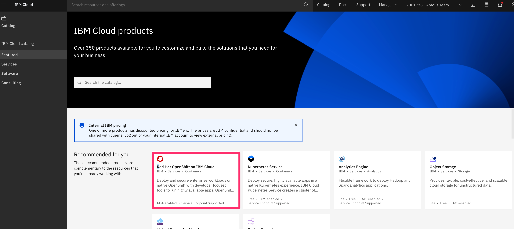
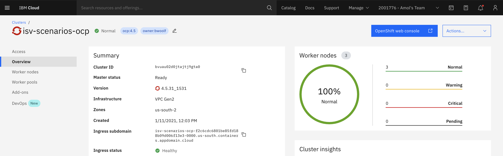

# Environment setup

To follow the steps in this learning path for developing Golang-based operators, you need to install the following software on your machine. Environment-specific installation instructions for installing  Operator SDK and the `oc` or `kubectl` CLIs and for provisioning a cluster are below.

## Prerequisites for installing Operator SDK on a macOS

To develop Golang-based operators on macOS, you need to install the following:

* [Homebrew](https://brew.sh/)
* [Go](https://golang.org/dl/) 1.10+
* [Kustomize](https://kubectl.docs.kubernetes.io/installation/kustomize/homebrew/)
* [kubectl](https://kubernetes.io/docs/tasks/tools/install-kubectl/)
* [Docker](https://docs.docker.com/get-docker/) v17.03+
* OpenShift CLI (**If you plan to deploy to OpenShift cluster**) [oc](https://docs.openshift.com/container-platform/4.5/cli_reference/openshift_cli/getting-started-cli.html)
* To use an OpenShift cluster, we recommend using <b>version 4.6+</b> <!--EM Do you mean, you need to have OpenShift v 4.6++ if you plan to deploy to an OpenShift cluster?-->

Additionally, you need:

* Access to a Kubernetes v1.11.3+ cluster (v1.16.0+ if using apiextensions.k8s.io/v1 CRDs). See [minikube](https://minikube.sigs.k8s.io/docs/start/) or [CodeReady Containers](https://code-ready.github.io/crc/#installing-codeready-containers_gsg) to access a free cluster.
* Cluster admin permission. See how to grant yourself cluster-admin privileges or be logged in as admin. <!--EM: Where do they see this? missing link?-->
* Access to a container registry such as [Quay.io](https://quay.io) or [DockerHub](https://hub.docker.com/)


### Prerequisites for installing opeartor-sdk on Linux and Windows

To develop Golang-based operators on Linux and Windows, you need to install the following:

* [dep](https://golang.github.io/dep/docs/installation.html) v0.5.0+
* [Git](https://git-scm.com/downloads)
* [Go](https://golang.org/dl/) v1.10+
* [Docker](https://docs.docker.com/get-docker/) v17.03+
* OpenShift CLI (oc) v4.1+ installed
* [Kustomize](https://kubectl.docs.kubernetes.io/installation/kustomize/)
* OpenShift CLI (**If you plan to deploy to OpenShift Cluster**) [oc](https://docs.openshift.com/container-platform/4.5/cli_reference/openshift_cli/getting-started-cli.html)
* To use an OpenShift cluster, we recommend you use <b>version 4.6+</b>

Additionally, you need:

* Access to a Kubernetes v1.11.3+ cluster (v1.16.0+ if using apiextensions.k8s.io/v1 CRDs). See [minikube](https://minikube.sigs.k8s.io/docs/start/) or [CodeReady Containers](https://code-ready.github.io/crc/#installing-codeready-containers_gsg) to access a cluster for free.
* Access to a container registry such as [Quay.io](https://quay.io) or [DockerHub](https://hub.docker.com/)


## Steps

1. [Install Operator SDK](#1-install-operator-sdk)
1. [Install oc or kubectl cli](#2-install-oc-or-kubectl-cli)
1. [(Optional) Provision OpenShift Cluster](#3-optional-provision-openshift-cluster)

## 1. Install Operator SDK

### Install Operator SDK (version 1.5+) for macOS

1. Install [Homebrew](https://docs.brew.sh/Installation) if you don't have it.
1. Use the Homebrew command `brew install operator-sdk` to install Operator SDK for macOS. This guide is tested for operator-sdk version 1.5+, since the commands have changed with the 1.0 release.

### Install Operator SDK (version 1.5+) for Linux or Windows

* For Linux or Windows, install the Operator SDK (version 1.0+) from the [GitHub release](https://sdk.operatorframework.io/docs/installation/#install-from-github-release). Note that commands have changed with the 1.0 release.

### Test your environment for Operator SDK

1. Run the following command in the terminal of your choice:

    ```bash
    $ operator-sdk version
    ```

1. You should see output like this:

    ```bash
    operator-sdk version: "v1.5.0", commit: "1abf57985b43bf6a59dcd18147b3c574fa57d3f6", kubernetes version: "v1.19.4", go version: "go1.15.5", GOOS: "darwin", GOARCH: "amd64"
    ```

1. Ensure kustomize is installed. Install it via brew for macOS: <!--EM: What about for Linux/Windows useres? Is that the second command here?-->

```bash
$ brew install kustomize
```

```bash
$ kustomize version
```

You should see output like this:

```bash
{Version:kustomize/v3.9.1 GitCommit:7439f1809e5ccd4677ed52be7f98f2ad75122a93 BuildDate:2020-12-30T01:08:17+00:00 GoOs:darwin GoArch:amd64}
```

## 2. Install oc or kubectl cli

If you plan to use an OpenShift cluster, install the OpenShift CLI (`oc`) using instructions in the [OpenShift docs](https://docs.openshift.com/container-platform/latest/cli_reference/openshift_cli/getting-started-cli.html).

Otherwise, install `kubectl` from the [Kubernetes docs](https://kubernetes.io/docs/tasks/tools/install-kubectl/).

Alternatively, you can install the `oc` CLI through the OpenShift web console as [this article](https://developers.redhat.com/openshift/command-line-tools) describes.

Test your CLI by issuing the following command to see the version of your CLI:

```
$ oc version
Client Version: openshift-clients-4.5.0-202006231303.p0-18-g6082e941e
Kubernetes Version: v1.19.2
```

If you plan to use `kubectl` instead of `oc` use:

```bash
$ kubectl version
Client Version: version.Info{Major:"1", Minor:"20", GitVersion:"v1.20.2", GitCommit:"faecb196815e248d3ecfb03c680a4507229c2a56", GitTreeState:"clean", BuildDate:"2021-01-14T05:15:04Z", GoVersion:"go1.15.6", Compiler:"gc", Platform:"darwin/amd64"}
Server Version: version.Info{Major:"1", Minor:"18+", GitVersion:"v1.18.3+e574db2", GitCommit:"e574db2", GitTreeState:"clean", BuildDate:"2021-01-30T06:33:00Z", GoVersion:"go1.13.15", Compiler:"gc", Platform:"linux/amd64"}
```

## 3. Provision an OpenShift cluster

(If you haven't already) provision an OpenShift cluster by going to `https://cloud.ibm.com/` and clicking `Red Hat OpenShift on IBM Cloud` tile. From there, you can select an OpenShift cluster of your choosing.

<b> We recommend you use an OpenShift cluster of version 4.6 or higher.</b>



After the cluster finishes provisioning, you should get a message that the Worker nodes are 100% normal, and the Master status is `ready`, as the picture below shows.



Provisioning an OpenShift cluster takes some time, so do so **now** if you don't have one already. Skip down to
[the prepare your OpenShift Cluster step](https://github.ibm.com/TT-ISV-org/operator/blob/main/BEGINNER_TUTORIAL.md#prepare-your-openshift-cluster) to see how to create an OpenShift cluster on IBM Cloud.

## Ensure OpenShift Lifecycle Manager (OLM) is updated

To make sure your OpenShift Lifecycle Manager is
up to date and running properly, run the `operator-sdk olm status` command:

```
operator-sdk olm status
INFO[0003] Fetching CRDs for version "0.16.1"           
INFO[0003] Using locally stored resource manifests      
INFO[0005] Successfully got OLM status for version "0.16.1"
NAME                                            NAMESPACE    KIND                        STATUS
operators.operators.coreos.com                               CustomResourceDefinition    Installed
operatorgroups.operators.coreos.com                          CustomResourceDefinition    Installed
installplans.operators.coreos.com                            CustomResourceDefinition    Installed
clusterserviceversions.operators.coreos.com                  CustomResourceDefinition    Installed
olm-operator                                    olm          Deployment                  Installed
subscriptions.operators.coreos.com                           CustomResourceDefinition    Installed
olm-operator-binding-olm                                     ClusterRoleBinding          Installed
operatorhubio-catalog                           olm          CatalogSource               Installed
olm-operators                                   olm          OperatorGroup               Installed
aggregate-olm-view                                           ClusterRole                 Installed
catalog-operator                                olm          Deployment                  Installed
aggregate-olm-edit                                           ClusterRole                 Installed
olm                                                          Namespace                   Installed
global-operators                                operators    OperatorGroup               Installed
operators                                                    Namespace                   Installed
packageserver                                   olm          ClusterServiceVersion       Installed
olm-operator-serviceaccount                     olm          ServiceAccount              Installed
catalogsources.operators.coreos.com                          CustomResourceDefinition    Installed
system:controller:operator-lifecycle-manager                 ClusterRole                 Installed
```

As you can see from this output above, all of the components of the OLM are in the `Installed` status which means your Operator Lifecycle Manager is working properly.
<b>Note: if you see an error, you can read the [SDK guide](https://sdk.operatorframework.io/docs/olm-integration/quickstart-bundle/#enabling-olm)to learn how to install OLM on your cluster.

### (Optional) Troubleshooting OLM error

If you get an error similar to the following two, you need to uninstall a specific version

#### Error 1
```bash
$ operator-sdk olm status
FATA[0002] Failed to get OLM status: error getting installed OLM version (set --version to override the default version): no existing installation found
```

#### Error 2

```bash
$ operator-sdk olm status
FATA[0002] Failed to get OLM status: error getting installed OLM version (set --version to override the default version): no existing installation found


$ operator-sdk olm install
FATA[0005] Failed to install OLM version "latest": detected existing OLM resources: OLM must be completely uninstalled before installation


$ operator-sdk olm uninstall
FATA[0002] Failed to uninstall OLM: error getting installed OLM version (set --version to override the default version): no existing installation found
```

These errors indicate the need to uninstall a specific version. My OpenShift cluster is version `4.5.31_1531`, so I had to uninstall version `0.16.1` using the following command.

```bash
$ operator-sdk olm uninstall --version 0.16.1
INFO[0009] Successfully uninstalled OLM version "0.16.1"
```

Next, I installed the same version, and checked the status:

```bash
$ operator-sdk olm install --version 0.16.1
INFO[0072] Successfully installed OLM version "0.16.1"  

$ operator-sdk olm status
INFO[0004] Successfully got OLM status for version "0.16.1"

NAME                                            NAMESPACE    KIND                        STATUS
operators.operators.coreos.com                               CustomResourceDefinition    Installed
operatorgroups.operators.coreos.com                          CustomResourceDefinition    Installed
installplans.operators.coreos.com                            CustomResourceDefinition    Installed
clusterserviceversions.operators.coreos.com                  CustomResourceDefinition    Installed
olm-operator                                    olm          Deployment                  Installed
subscriptions.operators.coreos.com                           CustomResourceDefinition    Installed
olm-operator-binding-olm                                     ClusterRoleBinding          Installed
operatorhubio-catalog                           olm          CatalogSource               Installed
olm-operators                                   olm          OperatorGroup               Installed
aggregate-olm-view                                           ClusterRole                 Installed
catalog-operator                                olm          Deployment                  Installed
aggregate-olm-edit                                           ClusterRole                 Installed
olm                                                          Namespace                   Installed
global-operators                                operators    OperatorGroup               Installed
operators                                                    Namespace                   Installed
packageserver                                   olm          ClusterServiceVersion       Installed
olm-operator-serviceaccount                     olm          ServiceAccount              Installed
catalogsources.operators.coreos.com                          CustomResourceDefinition    Installed
system:controller:operator-lifecycle-manager                 ClusterRole                 Installed
```

Once everything says installed, <b>congratulations</b> you are ready to start developing!


## Conclusion
If you've installed these prerequisites, your environment is set up to develop an operator
and deploy it to an OpenShift (or Kubernetes) cluster. Check out the [Develop and Deploy a Memcached Operator](https://github.ibm.com/TT-ISV-org/operator/blob/main/BEGINNER_TUTORIAL.md) tutorial.
